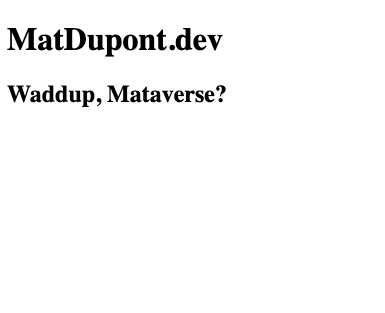

# The initial setup

Here's what I'm thinking, and why:

I know [React](https://reactjs.org/) really well. I also want to learn Vue and Svelte at some point. So, I'll be using React as the main container for the site.

Ideally, I'll be learning the other two (and maybe others down the road) and will be able to use this site as a playground to learn and practice with the other frameworks.

How?! [Microfrontends](https://microfrontends.info/microfrontends/)! Specifically, client-side run-time integration. I may mess around with other techniques in the future.

In theory, I should be able to use any framework that uses [Webpack 5](https://webpack.js.org/) and [Module Federation](https://webpack.js.org/plugins/module-federation-plugin/) to build components/applications and stitch them all together on this site. I'm not actually sure Svelte uses webpack because I haven't tried it at all yet, but I've played with Vue from the perspective of a microfrontend and know that should work.

With that, I'll be doing this initial setup with React and Webpack 5. I've been messing around with Webpack and Typescript lately, so I'll keep up with that practice and configure things from scratch as much as possible. I'll be avoiding CRA for that reason.

What else?

[ESlint](https://eslint.org/), naturally. [Prettier](https://prettier.io/), of course!

Babel? ... maybe not. Dealing with some slow build times on another project, I found that swapping out babel for [esbuild-loader](https://github.com/privatenumber/esbuild-loader) (and esbuild-jest) sped things up drastically. I think I'll go that route, at least until I hit a wall. 🤞

I think I dig [Typescript](https://www.typescriptlang.org/). At least, I think I should. In either case, I want to practice so I'll go with that too.

I would consider using [esbuild](https://github.com/evanw/esbuild) rather than webpack, but I have no experience with module federation with esbuild and have no idea if that's a thing yet. One thing at a time.

Deployment? 🤷 Future Mat's problem.

## Okay, let's do this!

```
yarn init
```

First, let me say I want this entire project setup to be as stripped down as possible. If I don't specifically need it or I'm not deliberately testing it out, I don't want it.

Also, I use specific package versions without the `^` in my _`package.json`_. I want all environments to have the exact same versions, so I make sure that's what I'm installing.

## Install React and Typescript

First, I'll install:

```
yarn add react react-dom

yarn add -D typescript @types/react @types/react-dom
```

Oh yeah, I use `yarn` because I like it. Pick one and stick to it within a project. Doesn't _really_ matter which.

The thing that matters is that I make sure to add any dependencies used for my environment and the build process as _devDependencies_. Hence the `-D` flag.

## Configure Typescript

I never remember this stuff, so I'm just grabbing this from a blog:

```
{
  "compilerOptions": {
    "module": "esnext",
    "lib": ["dom", "dom.iterable", "esnext"],
    "allowJs": true,
    "allowSyntheticDefaultImports": true,
    "skipLibCheck": true,
    "esModuleInterop": true,
    "strict": true,
    "forceConsistentCasingInFileNames": true,
    "moduleResolution": "node",
    "resolveJsonModule": true,
    "isolatedModules": true,
    "noEmit": true,
    "jsx": "react"
  },
  "include": ["src"]
}
```

Dump that into my _`tsconfig.json`_. See how that goes.

### Bootstrapping the `<App />`

Note: I [read](https://twitter.com/dan_abramov/status/1308739731551858689?s=20) from the man, himself (Dan Abramov) that future versions of React will not support the default import, so I go for `import * as React from 'react'`, now.

Check the `/src/index.tsx` file for the whole bit, but I want to point out that I'm using `<React.StrictMode>`. I've never used it and I want to see what's up.

```
ReactDOM.render(
  <React.StrictMode>
    <App />
  </React.StrictMode>,
  document.getElementById("root")
);
```

I'm doing this now so I have _something_ for the following steps.

## Linting

Let's get the linter going first.

```
yarn add -D eslint
```

Now, I can create my config file:

```
yarn create @eslint/config
```

Doing it this way is as simple as answering questions at the prompt.

I'm going with with:

- check syntax, find problems, and enforce code style
- JavaScript moduldes (import/export)
- React
- A solid "Yes" to using Typescript
- Running in the Browser, no doubt.
- Might as well use a popular style guide. I'll start with airbnb and tweak as I see fit.
- Let's go with a JavaScript config file

Of course, let it install the required deps.

\* In order to keep things tidy, I leverage `*rc.js` files rather than throwing everything into my package.json file. Sticking with `.js` files rather than `.json` files lets me comment things out as I debug configurations.

**\* At this point, VSCode was like "Holy shit, Dupont... You don't have a `.gitignore` file!"**

Even offered to create it for me and add `node_modules` to it.

Do that.

Now, let's give it a whirl:

```
npx eslint src/*
```

Output: 😐 All good, I can fix most of this with a flag.

```
   1:24  error  Strings must use singlequote                      quotes
   2:27  error  Strings must use singlequote                      quotes
   4:13  error  Function component is not a function declaration  react/function-component-definition
   5:3   error  JSX not allowed in files with extension '.tsx'    react/jsx-filename-extension
  15:27  error  Strings must use singlequote                      quotes
  15:34  error  Missing trailing comma                            comma-dangle
```

Time to add my lint script to _`package.json`_:

```
"scripts": {
  "lint": "eslint --cache --fix src/*"
}
```

But, still... dafuq?

```
 6:5  error  JSX not allowed in files with extension '.tsx'  react/jsx-filename-extension
```

Just missing a rule in the _`.eslintrc.js`_ file. Tweak #1!

```
rules: {
    "react/jsx-filename-extension": [
      2,
      { extensions: [".js", ".jsx", ".ts", ".tsx"] },
    ],
  }
```

Fixed 💪

```
➜  matdupont.dev git:(main) ✗ yarn lint
yarn run v1.22.15
$ eslint --cache --fix src/*
✨  Done in 2.40s.
```

\* Don't forget to add _`.eslintcache`_ to _`.gitignore`_

## Compiling and bundling

As mentioned above, I'll be using `esbuild-loader` to do the compilation but sticking with `webpack` for the bundling. If I run into issues with esbuild and my module federation, I may switch to babel. For now, this is it.

#### Webpack and the Dev Server

```
yarn add -D webpack wepback-cli webpack-dev-server
```

#### HtmlWebpackPlugin

This plugin is what puts together my output html file, loaded with my bundle(s)

```
yarn add -D html-webpack-plugin
```

#### Esbuild and the loader

```
yarn add -D esbuild esbuild-loader
```

#### The config file

\* Apparently I can use a Typescript for my config file if I install `ts-node`. I'm going to try that.

```
yarn add -D ts-node @types/node
```

This also means I'll need types for packages used in my webpack config.

```
yarn add -D @types/html-webpack-plugin
```

Here's the initial _`webpack.dev.config.ts`_ file:

```
import path from "path";
import { Configuration, HotModuleReplacementPlugin } from "webpack";
import HtmlWebpackPlugin from "html-webpack-plugin";

const config: Configuration = {
  mode: "development",
  output: {
    publicPath: "/",
  },
  entry: "./src/index.tsx",
  module: {
    rules: [
      {
        test: /\.tsx?$/,
        loader: "esbuild-loader",
        exclude: /node_modules/,
        options: {
          loader: "tsx",
          target: "es2015",
        },
      },
    ],
  },
  resolve: {
    extensions: [".tsx", ".ts", ".js"],
  },
  plugins: [
    new HtmlWebpackPlugin({
      template: "src/index.html",
    }),
    new HotModuleReplacementPlugin(),
  ],
  devtool: "inline-source-map",
  devServer: {
    static: path.join(__dirname, "build"),
    historyApiFallback: true,
    port: 4000,
    open: true,
    hot: true,
  },
};

export default config;

```

Time to try this out with a new `dev` script:

```
  ...,
  "scripts": {
    ...
    "start": "webpack serve --config webpack.dev.config.ts",
  },
  ...
```

## Moment of truth!

```
yarn dev
```

...

### ... So many Typescript issues

After messing with a pile of ts problems, I'm backing out and switching to _`webpack.dev.config.js`_ for old time's sake.

After renaming to _`webpack.dev.config.js`_, rip out the type stuff and convert to commonJS.

```
const path = require("path");
const { HotModuleReplacementPlugin } = require("webpack");
const HtmlWebpackPlugin = require("html-webpack-plugin");
...


module.exports = {
  ...
}
```

In _`package.json`_:

```
....
"scripts": {
  ...
  "dev": "webpack serve --config webpack.dev.config.js"
  ...
}
```

## Let's try this again!

```
yarn dev
```

🚀 🤘 I'm in business!

```
<i> [webpack-dev-server] Project is running at:
<i> [webpack-dev-server] Loopback: http://localhost:4000/
```



## Shit, I forgot Prettier!

... stay tuned
