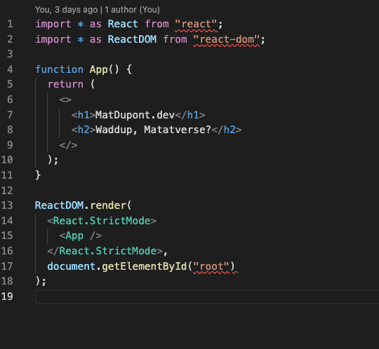

# The Setup Continued

## Resolving new issues

So, yeah... I forgot about Prettier and configuring my VSCode on-save settings properly. Not an uncommon occurrance.



Looks like I have some competing rules going on here.

I read the warnings, my linter is expecting single quotes and I'm using doubles:


Should be simple enough, right? I'm not auto-saving and typed in the wrong quotes. No big deal.

Let's fix that and save:

```
import * as React from 'react';
import * as ReactDOM from 'react-dom';
```

**Wrong!**

It actually is auto-saving and reverting to the double quotes. 🤷

In a pinch, I could simply [change the eslint rule](https://eslint.org/docs/rules/quotes) to use double quotes and walk away:

_`.eslintrc.js`_:

```
...
rules: {
  quotes: "off",
}
...
```

I don't like not knowing what's going here and it's very likely I'll run into other competing rules (eg: "Missing trailing comma")

## Debugging my editor settings

While thinking about what could be causing the auto-saving issue, I figured I should check what Extensions I have running that may be causing this.

**Ah hah!**

I already have the [Prettier Extension](https://marketplace.visualstudio.com/items?itemName=esbenp.prettier-vscode) installed, but haven't configured it.

After disabling it, I test the manual change to single quotes in my index.tsx file and see the auto-save revert is no longer happening.

## Configure Prettier

Okay, what's the deal with Prettier anyway? Why do I care and why am I doing this?

It's really \*just\*\* about code consistency. I want my site to be pretty and that transcends beyond what renders in the browser. I want my codebase to be easy to read and consistent as well. It also helps when debugging issues.

Eslint helps catch my errors and Prettier formats it for me. They can easily be configured to work hand-in-hand.

First, I'll install prettier and the associated eslint config and plugin:

```
  yarn add -D prettier eslint-config-prettier eslint-plugin-prettier
```

Next, I'll create the config file. Again, I'll leverage an rc file rather than throw things into the package.json.

_`.prettierrc.js`_:

```
module.exports = {
  printWidth: 100,
  singleQuote: true,
};
```

My _`.eslintrc.js`_ file also needs a small update to make use of prettier:

```
...
extends: ['plugin:react/recommended', 'airbnb', 'prettier'],
plugins: ['react', '@typescript-eslint', 'prettier'],
rules: {
  ...
  'prettier/prettier': ['error'],
}
...
```

**Nice!** 💪


Before moving on, I want to make sure I'm not running prettier on every single file in my repo.

Similar to git, prettier supports an ignore file. \_`.prettierignore`:

```
# Ignore artifacts:
build
coverage
```

## Type checking

At this point, my dev environment is running fine and my _seems_ to be running fine. Truth be told, I only have one React component and I'm still missing some fundamental checks in my compilation and bundling process to do.

I'm using esbuild-loader to compile my `tsx?` files, I'm linting with the `@typescript-eslint` parser and plugin, but am I actually type checking my code?

Not really. I just think I am.

"How do I know that?", you may ask.

I'm going to add something to my _`index.tsx`_ to show test this.

```
function App({ test }) {
  return (
    <>
      <h1>MatDupont.dev</h1>
      <h2>Waddup, Matatverse?</h2>
      {test}
    </>
  );
}
```


**PropTypes!?**

Oh, yeah. The airbnb rule set requires all React components to have defined propTypes.

PropTypes are fine if you're using regular `.jsx` components, but I'm using Typescript. I don't want to double up on my typing for no reason.

I'll turn off this rule for my project.

_`.eslintrc.js`_

```
...
rules: {
  ...
  'react/prop-types': ['off'],
  'react/require-default-props': ['off']
}
```

Now, I should be seeing my Typescript-specific lint error:


There! The type checking works!

**Wrong again!**

Let's run the app. It _should_ fail, right?


Hmmm... guess not.

### Type checking in Webpack

Oh, no.

Upon opening my `webpack.dev.config.js` file, I see some lint errors. Simply saving will format the file properly (eg: remove those double quotes) but I'm still left with a few issues.

This is happening because I chose to use a `.js` file for my config rather than `.json`. This is a personal preference, and this lint issue shouldn't be present if you choose the `.json` format.

What's happening is that my config file is being linted and failing the airbnb rule set:


I don't want to turn off this rule for my whole codebase and I want to keep using the `.js` format. Here are a few of my options:

- Ignore the `no-extraneous-dependencies` rule for each offending line
- Ignore the rul for the entire file
- Adjust _`.eslintrc.js`_ to override rules for specific files.

The last option is more deliberate (and declarative), so that's the one I'll go with.

In addition, I'll take this opportunity to move my \_`webpack.dev.config.js` file to a new `/config` folder at the root of my project. I'll be adding at least one more config file, so I'd like to keep them grouped.

I'll add this to my _`.eslintrc.js`_ file:

```
...
overrides: [
  {
    files: ['config/*.js'],
    rules: {
      'import/no-extraneous-dependencies': [
        'error',
        {
          devDependencies: ['**/*.config.js'],
        },
      ],
    },
  },
],
...
```

What I'm doing here is telling eslint to override the base rule set specifically for `.js` files within the `config` folder.

Within that scope, I want to show an error for this rule **unless** the import is a devDependency done within a file ending in `.config.js`.

I had to reload VSCode for this change to take effect, but we're good now.

\*Tip: `Command+Shift+P` opens the VSCode command menu. Start typing 'Reload' until you see the 'Developer: Reload Window' command. Hit that one with your mouse or keyboard.

### ForkTsCheckerWebpackPlugin

Since I'm already using a loader for my typescript (`esbuild-loader`), I don't want to add `ts-loader` or use `tsc`. Luckily, I can add the `ForkTsCheckerWebpackPlugin` (from the makers of `ts-loader`, `ts-node`, etc...) to my config to add type checking to my current setup.

This is a "**Webpack plugin that runs TypeScript type checker on a separate process.**" Sweet, I dig it.

Install:

```
yarn add --dev fork-ts-checker-webpack-plugin
```

Config:
_`webpack.dev.config.js`_:

```
const ForkTsCheckerWebpackPlugin = require('fork-ts-checker-webpack-plugin');

module.exports = {
  ...
  plugins: [
    ...
    new ForkTsCheckerWebpackPlugin()
  ]
...
```

Now, we run:

```
yarn dev
```

And we expect:


**This is what I want!**

Now I can clean up my `index.tsx` and get to the next part.

## Linting during compilation.

Okay, so I was type checking in the IDE but not at compilation time. But I'm linting though, right?

Nope. Same deal.


Time to add `eslint-webpack-plugin`:

Install:

```
yarn add --dev eslint-webpack-plugin
```

Config:
_`webpack.dev.config.js`_:

```
const ForkTsCheckerWebpackPlugin = require('fork-ts-checker-webpack-plugin');

module.exports = {
  ...
  plugins: [
    ...
    new ForkTsCheckerWebpackPlugin(),
    new ESLintPlugin({
      extensions: ["ts", "tsx"],
    }),
  ]
...
```

And now:


Yes! Okay... clean that up.

**_Oh, man... are we there yet?!_**

## Building

I'm satisfied with my development environment _for now_. This works! In the interest of only adding config and dependencies **if** I need them, I'll move on.

Now, I want to create a successful build. I'm less concerned about optimizing the build at the point, although I will definitely circle back to this sooner than later.

### The Config

First step, my config file: _`webpack.prod.config.js`_

```
const path = require('path');
const HtmlWebpackPlugin = require('html-webpack-plugin');
const ForkTsCheckerWebpackPlugin = require('fork-ts-checker-webpack-plugin');
const ESLintPlugin = require('eslint-webpack-plugin');
const { CleanWebpackPlugin } = require("clean-webpack-plugin");

module.exports = {
  mode: "production",
  entry: "./src/index.tsx",
  output: {
    path: path.resolve(__dirname, "../build"),
    filename: "[name].[contenthash].js",
    publicPath: "",
  },
  module: {
    rules: [
      {
        test: /\.tsx?$/,
        loader: 'esbuild-loader',
        exclude: /node_modules/,
        options: {
          loader: 'tsx',
          target: 'es2015',
        },
      },
    ],
  },
  resolve: {
    extensions: [".tsx", ".ts", ".js"],
  },
  plugins: [
    new HtmlWebpackPlugin({
      template: "src/index.html",
    }),
    new ForkTsCheckerWebpackPlugin({
      async: false,
    }),
    new ESLintPlugin({
      extensions: ["ts", "tsx"],
    }),
    new CleanWebpackPlugin(),
  ],
};
```

You might notice a few differences.

First, this one is setting `mode: "production"`. This tells Webpack to create an optimized build with a few things out of the box. Minification and all that jazz.

Next, we have a new `output` configuration. Here, we tell webpack where to put the build (`path`), the format of the build filnames (content hashed) and the base publicPath.

Lastly, we swap out a few plugins. We no longer need the `HotModuleReplacementPlugin`, but we do want to clean up the previous build as a new one is created. For this, we tack on `new CleanWebpackPlugin()` and make sure to install it as a devDependency.

```
yarn add -D clean-webpack-plugin
```

### The Script

_`package.json`_:

```
"build": "webpack --config config/webpack.prod.config.js"
```

**Success!**


😐 Better `.gitignore` that `/build` folder.

_`.gitignore`_:

```
node_modules
.eslintcache

build
```

### Duplication

You may be wondering, "isn't there some duplication in those webpack config files?"

Yeah, there is. **DRY!**

At this point, I could extract out the duplicate code into a `webpack.common.config.js` file and strip down the `dev` and `prod` config files.

Let's see!

First, I'll install `webpack-merge`. This provides a `merge` function used to combine the common file with the unique config values of each environment file

```
yarn add -D webpack-merge
```

Now, I'll strip out thge duplicate code:

_`webpack.common.config.js`_:

```
const { HotModuleReplacementPlugin } = require('webpack');
const HtmlWebpackPlugin = require('html-webpack-plugin');
const ForkTsCheckerWebpackPlugin = require('fork-ts-checker-webpack-plugin');
const ESLintPlugin = require('eslint-webpack-plugin');
const { CleanWebpackPlugin } = require('clean-webpack-plugin');

module.exports = {
  entry: './src/index.tsx',
  module: {
    rules: [
      {
        test: /\.tsx?$/,
        loader: 'esbuild-loader',
        exclude: /node_modules/,
        options: {
          loader: 'tsx',
          target: 'es2015',
        },
      },
    ],
  },
  resolve: {
    extensions: ['.tsx', '.ts', '.js'],
  },
  plugins: [
    new HtmlWebpackPlugin({
      template: 'src/index.html',
    }),
    new HotModuleReplacementPlugin(),
    new ForkTsCheckerWebpackPlugin(),
    new ESLintPlugin({
      extensions: ['ts', 'tsx'],
    }),
    new CleanWebpackPlugin(),
  ],
};
```

_`webpack.dev.config.js`_:

```
const path = require('path');
const { merge } = require('webpack-merge');
const common = require('./webpack.common.config');

module.exports = merge(common, {
  mode: 'development',
  output: {
    publicPath: '/',
  },
  devtool: 'inline-source-map',
  devServer: {
    static: path.join(__dirname, 'build'),
    historyApiFallback: true,
    port: 4000,
    open: true,
    hot: true,
  },
});
```

_`webpack.prod.config.js`_:

```
const path = require('path');
const { merge } = require('webpack-merge');
const common = require('./webpack.common.config');

module.exports = merge(common, {
  mode: 'production',
  output: {
    path: path.resolve(__dirname, '../build'),
    filename: '[name].[contenthash].js',
    publicPath: '',
  },
});

```

## Good! 😅
