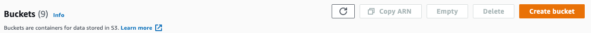
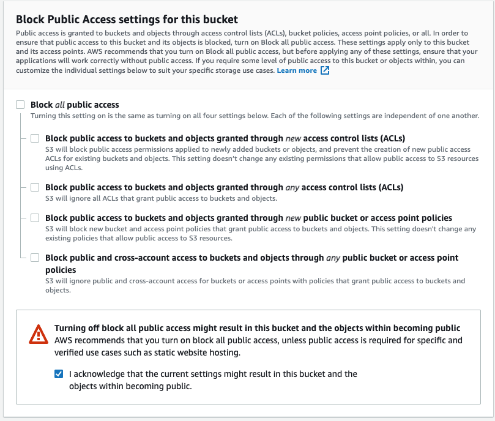

# My Deployment Pipeline

Sometimes I prefer to build, and build fast. I'll worry about deployment when I get to it, but I want to test out an idea or flesh out a product UI quickly. I might scrap it before it gets to a deployment, so why put in that time up front?

Other times, I know a project is going up. Even a plain, white page with a black title published to the internet is working software after all. I'll be iterating, and I'm probably going to want to show it off to my lovely wife. She total cares about CSS animations and State Management...

This is one of those latter scenarios. I'm not sure what my site will look like or what I'm actually putting on it, but I want it up right now.

I also want it up to date on the web with next to zero work on my end as I iterate.

This deployment pipeline will likely change as I try out new hosting platforms, but for now I'm looking at [AWS](https://console.aws.amazon.com/). Specifically, I'll be leveraging [S3](https://s3.console.aws.amazon.com/) for static hosting and [CloudFront](https://console.aws.amazon.com/cloudfront/) for my CDN.

I've tried [Netlify](https://www.netlify.com/) and really like their stuff. I'd like to give [Vercel](https://vercel.com/) a whirl sometime as well (❤️ NextJS).

For no other reason that to toy around with the pipeline myself, I'll be hand rolling this one.

## AWS

Sign up. I won't be going through that part.

### My S3 bucket

This bucket is the home of my static site. Time to create one:



This isn't my first rodeo, so I have another bucket from which I can copy settings. I'll describe those here:

Give the bucket a name. Set the AWS Region closest to me.

Leave all the default values in aside from one section: **Block Public Access settings for this bucket**

I'll be serving the content of this bucket out to the internet, so I don't want it completely locked down.

Uncheck **Block _all_ public access** and all it's child settings.

**Create!**



One last thing before moving one, I'll set the bucket policy to allow all objects within it to be publicly accessible.

Under the bucket _Permissions_, I'll see that "Objects can be public". That's not quite what I need.

I'll add the following policy

```
{
  "Version": "2012-10-17",
  "Statement": [
    {
      "Sid": "Stmt1643602258446",
      "Action": [
        "s3:GetObject"
      ],
      "Effect": "Allow",
      "Resource": "arn:aws:s3:::${BucketName}/*",
      "Principal": "*"
    }
  ]
}
```

- Replace _${BucketName}_ with the name of your bucket.

What I'm doing here is creating a policy where this particular bucket _Allows_ the _GetObject_ action on any resource within the bucket.

Upon saving, I can see this bucket is now publicly accessible. Perfect!

Okay, so now I have my bucket ready to go.

### My CloudFront Distribution

I'll head on over to CloudFront in the AWS console and smack that _Create Distribution_ button.

My _Origin domain_ is the S3 bucket I just created, so I'll select that.

I'll stick with the defaults for the rest for now.

**Create Distribution!**

If I go back to my S3 bucket, I'll see that it's Permissions policy has been updated to reflect the OAI.

## Manual Deployment

I want to see if this setup is working, so I'll try it manually before I add complexity by automating things.

```
yarn build
```

In the bucket, I hit that _Upload_ button and select the files **within** my build folder. Not the folder itself.

From the CloudFront distribution, I copy the _Distribution domaion name_ and throw that into my browser's address bar.

**Works!** [Demo](https://d11boqsx3hjdwp.cloudfront.net/)

Now, I have to get new versions of my code up there without this whole manual process.

## Automation

... stay tuned.
