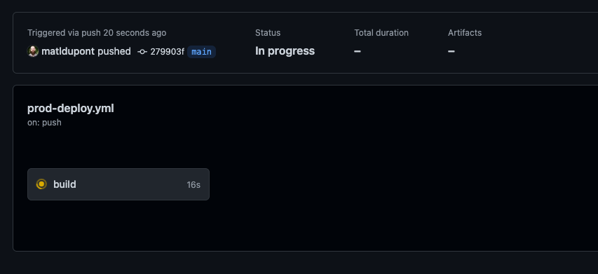
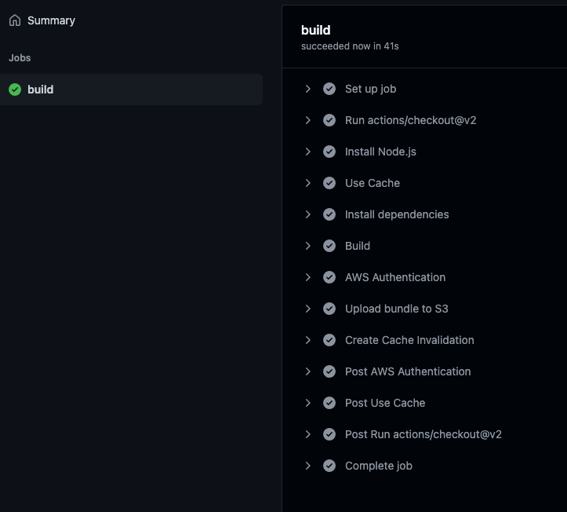
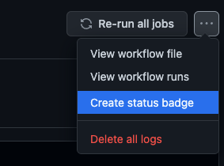

# Deployment Automation

What I want out of my deployment workflow is to push to `main` and watch it go out. That's it.

In the future, maybe I'll try my hand at automating PR previews or something. Who knows!?

My tool of choice of this kind of work is [Github Actions](https://github.com/features/actions) (or workflows).

## Github Actions

These worflows are implemented in your project's codebase and work as soon as they exist (and make sense).

Here's the idea for the workflow:

- I want it to run when I push to the `main` branch.
- Tell it which Node version to use for the work.
- Cache my `node_modules` to speed up my installs.
- Install my project dependencies.
- Build my project for production
  - My build process runs eslint and does my type checking, so I don't have to run those manually.
- Authenticate with AWS
- Upload the build to my S3 bucket
- Create a Cache Invalidation in CloudFront

There are a ton of resources online for these common worflows. Here's mine.

At the root of the project, I'll create a `.github/workflows/prod-deploy.yml`

_`prod-deploy.yml`_:

```
name: Deploy to Production

on:
  push:
    branches:
      - 'main'

jobs:
  build:
    runs-on: ubuntu-latest
    steps:
      - uses: actions/checkout@v2

      - name: Install Node.js
        uses: actions/setup-node@v1
        with:
          always-auth: true
          node-version: "16"


      - name: Use Cache
        uses: actions/cache@v2
        with:
          path: |
            node_modules
            */*/node_modules
          key: ${{ runner.os }}-${{ hashFiles('**/yarn.lock') }}

      - name: Install dependencies
        run: yarn install

      - name: Build
        run: yarn build

      - name: AWS Authentication
        uses: aws-actions/configure-aws-credentials@v1
        with:
          aws-access-key-id: ${{ secrets.AWS_ACCESS_KEY_ID }}
          aws-secret-access-key: ${{ secrets.AWS_SECRET_ACCESS_KEY }}
          aws-region: us-east-1

      - name: Upload bundle to S3
        run: aws s3 sync build s3://${{ secrets.AWS_S3_BUCKET_NAME }}

      - name: Create Cache Invalidation
        run: aws cloudfront create-invalidation --distribution-id ${{ secrets.AWS_DISTRIBUTION_ID }}

```

I'm clearly not publishing any keys or important information to this public repo, so I'm creating secrets for all the important stuff.

In my repo's _Settings_, I'll look for _Secrets->Actions_ in the left menu.

`AWS_S3_BUCKET_NAME` -> Whatever you named your S3 bucket
`AWS_DISTRIBUTION_ID` -> The ID of you CloudFront distribution

What about `AWS_ACCESS_KEY_ID` and `AWS_SECRET_ACCESS_KEY`?

For those, I actually have to create some specific access credentials within AWS. For this, I head over to [AWS IAM](https://console.aws.amazon.com/iam/).

I need to create a new user that has access to manage both my S3 bucket and the CloudFront distribution.

I'll give it a name and select the **Access key - Programmatic access** type of credential.

I want this user to have both _AmazonS3FullAccess_ and _CloudFrontFullAccess_ so I'll create a Group that has both those. I'll call this one "cicd-deploy" and create it.

It's now in the list of groups to which I can add my new user and already selected. Next!

No tags. Next!

Looks good. Create User!

This new user has the credentials I need for my Github `prod-deploy` workflow. I'll download the `.csv` containing my credentials to keep them safe.

Finally, I'll take the **Access key ID** and **Secret access key** and store them in my Github Secrets as `AWS_ACCESS_KEY_ID` and `AWS_SECRET_ACCESS_KEY`, respectively.

## Running the workflow

At this point, I have to actually push to `main` for the workflow to register with Github and actually run.

**Go time!**



**Success!**



I can also add a badge to my repo's `README.md`



[](https://github.com/matldupont/matdupont-dev/actions/workflows/prod-deploy.yml)

## Now what?
