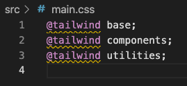
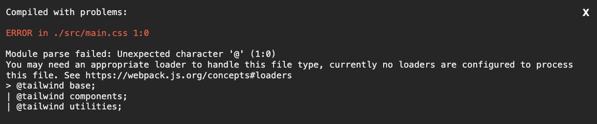
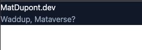

# The Homepage

I guess I should start here.

But, what do I want on my homepage?

My photo? Sure. A little blurb? And how! Some social links? Yeah, that works.

I **definitely** want a link to the this github repo, so that'll be there.

## Style and Design

I'm pretty comfortable with CSS and designing in the browser, so I'll just start slapping stuff on the page and go from there.

As mentioned on the main [README](https://github.com/matldupont/matdupont-dev), I'll be trying this out on this site. Time to try something new!

## Glassmorphism

We'll see if this turns out horrible or magical, but I've been reading about [Glassmorphism](https://dribbble.com/tags/glassmorphism). If not just to flex some CSS muscles, I'll try it out for the first iteration of my homepage.

The main idea is to use blur and transparency to make elements look like frosted glass over a gradient or image background. Probably a litte dry over a solid color. Beyond that, the trick seems to be keeping it light.

Don't overdo it!

Keep the important elements accessible and well defined. Don't glass up the entire thing.

So the question is: image or gradient?

....

**Gradient!**

So I guess I should iron out my css strategy.

## Choosing a CSS strategy

I like to keep things organized and reusable.

I've done basic [BEM](http://getbem.com/introduction/) CSS, BEM with [Sass](https://sass-lang.com/), CSS-in-JS libraries like [`styled-components`](https://styled-components.com/), [Emotion](https://emotion.sh/), either of the last two with [Styled System](https://styled-system.com/) then [Theme UI](https://theme-ui.com/), [MUI](https://mui.com/), etc...

They were all good for styling, while some afforded me a better DX and reusability. Right now, Emotion with Theme UI would be my go-to for a project and a tight deadline. This site has no deadline, so I'll finally give [Tailwind CSS](https://tailwindcss.com/) a try. I hear great things!

What I like about it (from an outside POV, thus far) is the [design-tokens](https://www.invisionapp.com/inside-design/design-tokens/)-as-utility kind of mentality. With the other frameworks, I like setting up my theme once and just running with it. Tailwind CSS is basically that. 💪

Curious to see how the DX is for responsive stuff, so we'll see how this goes!

## The Setup

I'm just following along with their documentation at this point, but I'll explain my choices (and snags) as I go.

There are four recommended ways to do the installation:

#### Tailwind CLI

Simplest and fastest. This one looks to just create the config file and rely on the cli to build the resulting `.css` file to use in the `/src/index.html`. Hmmm...

#### Using PostCSS

> "Installing Tailwind CSS as a PostCSS plugin is the most seamless way to integrate it with build tools like webpack, Rollup, Vite, and Parcel."

Sounds promising!

#### Framework Guides

Need not apply.

#### Play CDN

I'm hopefully doing a bit more than just playing here.

**Using PostCSS is the winner!**

```
yarn add -D tailwindcss postcss autoprefixer
npx tailwindcss init -p
```

Now I have my _`tailwind.config.js`_ and _`postcss.config.js`_ files.

I'll leave the _`postcss.config.js`_ file as is:

```js
module.exports = {
  plugins: {
    tailwindcss: {},
    autoprefixer: {},
  },
};
```

And I'll tell _`tailwind.config.js`_ to look for the content in `.tsx` files within the `/src` folder:

```js
module.exports = {
  content: ['./src/**/*.{tsx}'],
  theme: {
    extend: {},
  },
  plugins: [],
};
```

Now I'll create my _`/src/main.css`_ file as recommended:

```css
@tailwind base;
@tailwind components;
@tailwind utilities;
```

I already know I'm looking at some issues because I'm not telling Webpack how to handle any css or styles yet.



I'll try adding some tailwind classes to my component and run it anyway.

_`/src/index.tsx`_:

```js
...
function App() {
  return (
    <div className="bg-gray-900">
      <h1 className="text-slate-100">MatDupont.dev</h1>
      <h2 className="text-slate-400">Waddup, Mataverse?</h2>
    </div>
  );
}
...

```

## Webpack

My tooling has no idea how to load css at this point. It's not happy.



Luckily, the error message gives me a hint as to what I need to do.

> You may need an appropriate loader to handle this file type, currently no loaders are configured to process this file

First, I'll install the loaders I need. This part, I've just learned from experience but Webpack's documentation explains this stuff.

```
yarn add -D style-loader css-loader postcss-loader
```

I'll need a new rule in my _`webpack.common.js`_ file to handle `.css` files.

```js
...
 rules: [
   ...
    {
      test: /\.css$/i,
      use: ['style-loader', 'css-loader', 'postcss-loader'],
    },
 ]
...
```

Restart my dev server and...



## Not too shabby!

... to be continued.
