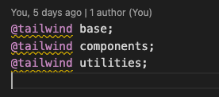
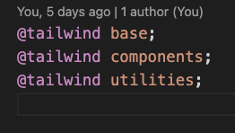
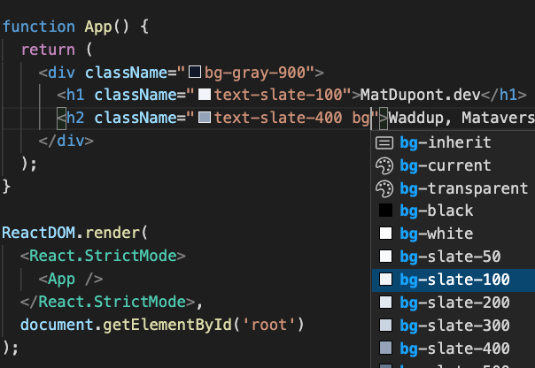

# TailwindCSS Setup Continued

## Setting Up VSCode

Tailwind has some documentation on [Editor Setup](https://tailwindcss.com/docs/editor-setup) to get the most of out their DX.

### PostCSS Language Support

The first thing mentioned is the warning I'm getting in my _`main.css `_ file:



The editor doesn't understand the `@tailwind` keyword, so the recommendation is to install the [PostCSS Language Support](https://marketplace.visualstudio.com/items?itemName=csstools.postcss) VSCode extention.

That made quick work of those hideous warnings.



### IntelliSense

The next thing I can do is install the [Tailwind CSS IntelliSense](https://marketplace.visualstudio.com/items?itemName=bradlc.vscode-tailwindcss) extension.

This gives me:

- Autocomplete
- Linking
- Hover Previews
- Syntax Highlighting

I'm going to give this a whirl.



Not too shabby...

## Optimize for Prod

Although I haven't actually built anything and don't have any major performance concerns, the Tailwind documentation does outline pretty easy prod setup to further minify my CSS code. I won't see much of a difference with this for while, but I might as well do this now. I might turn it off down the road as a test to see how much I get out of it.

First, install `cssnano`:

```
yarn add -D cssnano
```

Then, I head over to my _`postcss.config.js`_ file and add:

```js
module.exports = {
  plugins: {
    tailwindcss: {},
    autoprefixer: {},
    ...(process.env.NODE_ENV === 'production' ? { cssnano: {} } : {}),
  },
};
```

This is telling PostCSS to use `cssnano` if the current `NODE_ENV` (environment) is set to production **production**.

Remember.

##### Development:

```
yarn dev
```

##### Production:

```
yarn build
```

## How it works

Time to read some docs and get a bit more acquainted.

Back later!
