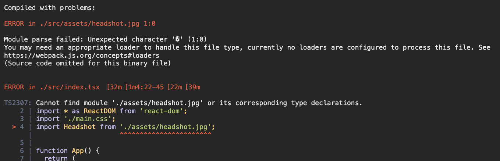
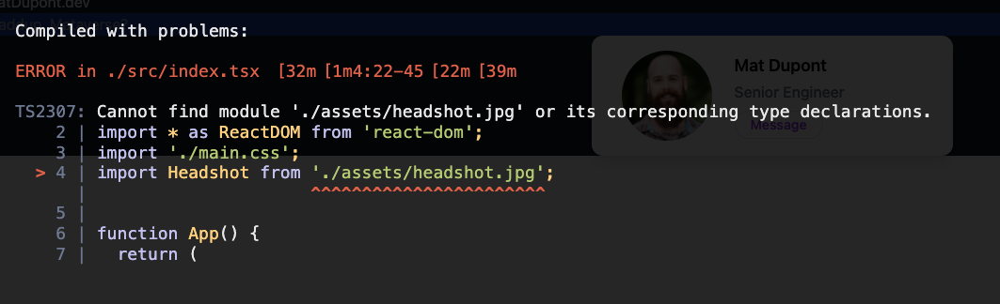

# Image Support

If you're following along, I'm in the process of getting familiar with [TailwindCSS](https://tailwindcss.com/docs/utility-first).

As I'm trying out some of the functionality, I got to this one example that includes a card containing a headshot, name, title and a message button.


I haven't used any images yet, so I figure I'll just add my own headshot to the repo. I created `/src/assets/` folder and put my `headshot.jpg` file in there.

I'm just using my _`index.tsx`_ file for now:

```js
...
import Headshot from './assets/headshot.jpg';

function App() {
  return (
    <div className="bg-gray-900">
      <h1 className="text-slate-100">MatDupont.dev</h1>
      <h2 className="text-slate-400 bg-blue-800">Waddup, Mataverse?</h2>

      <div className="py-8 px-8 max-w-sm mx-auto bg-white rounded-xl shadow-lg space-y-2 sm:py-4 sm:flex sm:items-center sm:space-y-0 sm:space-x-6">
        
        <div className="text-center space-y-2 sm:text-left">
          <div className="space-y-0.5">
            <p className="text-lg text-black font-semibold">Mat Dupont</p>
            <p className="text-slate-500 font-medium">Senior Engineer</p>
          </div>
          <button
            type="button"
            className="px-4 py-1 text-sm text-purple-600 font-semibold rounded-full border border-purple-200 hover:text-white hover:bg-purple-600 hover:border-transparent focus:outline-none focus:ring-2 focus:ring-purple-600 focus:ring-offset-2"
          >
            Message
          </button>
        </div>
      </div>
    </div>
  );
}
...
```

I'm importing my image, then using that as the `src` of the `` element.

**No bueno!**



Time to add an asset loader to my webpack config!

Luckily, Webpack has an asset loader so I won't need to install any dependencies:

_`webpack.common.config.js`_:

```js
...
rules: [
  ...
   {
      test: /\.(png|jpg|jpeg|gif)$/i,
      type: 'asset/resource',
    },
]
...
```

Restart the dev server and see what's up.

😕



Weird, the image is showing but Typescript still isn't very happy with the type.

After some research on [Wildcard module declarations](https://rmolinamir.github.io/typescript-cheatsheet/#wildcard-module-declarations), I have some custom modules declared.

First, I create a _`/src/custom.d.ts`_ file to store the new module delcarations, then I populate it with:

```js
declare module '*.png' {
  const value: any;
  export = value;
}

declare module '*.jpg' {
  const value: any;
  export = value;
}

declare module '*.jpeg' {
  const value: any;
  export = value;
}

declare module '*.gif' {
  const value: any;
  export = value;
}

```

Check my page and...

**Success!**


## Image Optimization

Stay tuned for a future post about this!
