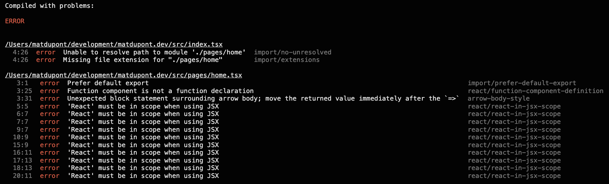
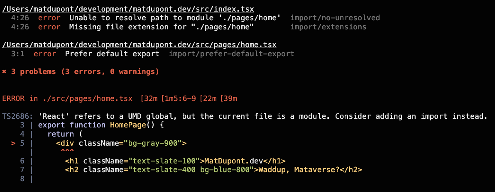
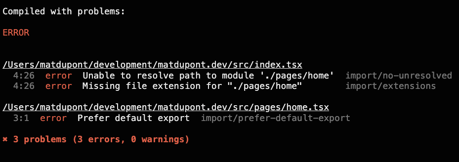
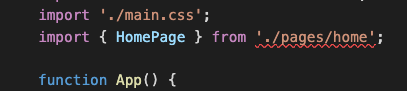
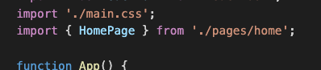
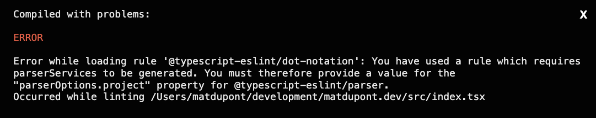
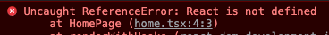
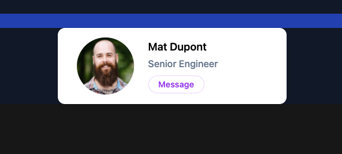

# My Homepage

Okay, time to actually put something together. It doesn't have to be much, but it has to be decent and help me learn more about [TWCSS](https://tailwindcss.com/)

## The first (non-App) Component

As of right now, all the jsx I've done is in the main _`index.tsx`_ file. I'm going to move that out to its own file. Because I'm building my homepage and I expect to build other pages, I'll follow some of the Next.js project structure and create a `/src/pages` folder.

Inside of that, I'll create my _`home.tsx`_ file and copy in what I'm currently rendering in `<App />`:

```js
import Headshot from '../assets/headshot.jpg';

export const HomePage = () => {
  return (
    <div className="bg-gray-900">
      <h1 className="text-slate-100">MatDupont.dev</h1>
      <h2 className="text-slate-400 bg-blue-800">Waddup, Mataverse?</h2>

      <div className="py-8 px-8 max-w-sm mx-auto bg-white rounded-xl shadow-lg space-y-2 sm:py-4 sm:flex sm:items-center sm:space-y-0 sm:space-x-6">
        
        <div className="text-center space-y-2 sm:text-left">
          <div className="space-y-0.5">
            <p className="text-lg text-black font-semibold">Mat Dupont</p>
            <p className="text-slate-500 font-medium">Senior Engineer</p>
          </div>
          <button
            type="button"
            className="px-4 py-1 text-sm text-purple-600 font-semibold rounded-full border border-purple-200 hover:text-white hover:bg-purple-600 hover:border-transparent focus:outline-none focus:ring-2 focus:ring-purple-600 focus:ring-offset-2"
          >
            Message
          </button>
        </div>
      </div>
    </div>
  );
};
```

Then, I update the _`index.tsx`_:

```js
...
import { HomePage } from './pages/home';

function App() {
  return <HomePage />;
}
...
```

## What the shit?!



Looks like some tweaks are in order! This looks like a mix of eslint rules, a sprinkle of typescript config and a dash of webpack.

The first thing I'll tackle is the "**'React' must be in scope when using JSX**" issue. Mostly because it takes the most space and I want to feel productive tonight.

First, I'll silence this rule.

_`.estlintrc.js`_

```js
...
  rules: [
    ...
    'react/react-in-jsx-scope': 'off',
  ]
```

Looking better...ish.



The linter isn't complaining, but this still aren't working.

I know I can squash this error by simply importing React. But it's 2022 and I know this isn't a hard necessity. I just need to configure typescript to do this for me.

\*I will likely import React myself throughout this codebase to use the `React.FC` type or some hooks, but that's not the point!

This one took a few minutes to figure out. It seems this new 'sans-React-import' functionality came with React 17 along with some new `jsx` factories for TypeScript. [Read more](https://devblogs.microsoft.com/typescript/announcing-typescript-4-1-beta/#jsx-factories)

The _`tsconfig.json`_ `compilerOptions.jsx:` value needed a small adjustment:

**Before**:

```js
"jsx": "react"
```

**After**:

```js
"jsx": "react-jsx"
```

Getting there!



Now, I don't like default exports. Maybe it's a personal thing. But, I've dealt with too many codebases where the default export gets renamed wrong and things end up all confusing 3 months later.

Export with a name, import by name. That's my preference. Renaming as I destructure from the import is one thing, but I want to be deliberate if I do it.

TLDR; I'm getting rid of the `import/prefer-default-export` rule.

_`.estlintrc.js`_

```js
...
  rules: [
    ...
    'import/prefer-default-export': ['off'],
  ]
```

The remaining issues have to do with an inability to resolve the path to my new component from the _`index.tsx`_



As it turns out, the `eslint-config-airbnb` rule set has a TypeScript counterpart.

```
yarn add -D eslint-config-airbnb-typescript
```

_`.eslintrc.js`_

```js
...
extends: ['plugin:react/recommended', 'airbnb', 'airbnb-typescript', 'prettier'],
...
```

No more editor warnings!



But the browser, now... 🤬



At least I'm getting some instructions, right?!

I already have parserOptions defined in my _`.eslintrc.js`_ file though. It's what parses all my js. I'll need an override specific to `ts/tsx` files:

```js
...
overrides: [
    ...
    {
      files: ['**/*.ts?(x)'],
      parser: '@typescript-eslint/parser',
      parserOptions: {
        tsconfigRootDir: __dirname,
        project: './tsconfig.json',
        sourceType: 'module',
        ecmaFeatures: {
          jsx: true,
        },
        warnOnUnsupportedTypeScriptVersion: true,
      },
    },
  ],
...
```

Here, I'm telling eslint to use the `@typescript-eslint/parser` for my `.ts?(x)` files using the _`tsconfig.json`_ file for the project, a `module` sourceType and `jsx` support. I also want it to throw a warning for unsupported TypeScript versions.

Reload and... uuuhhh.


Check the browser console.

**Still with the React import issue!?**



Here's where that dash of Webpack comes in!

The [ProvidePlugin](https://webpack.js.org/plugins/provide-plugin/) is what we want.

_`webpack.common.config.js`_

```js
const { HotModuleReplacementPlugin, ProvidePlugin } = require('webpack');

...
plugin: [
  ...
  new ProvidePlugin({
    React: 'react',
  }),
]
...
```

Reload again and I'm back in business!



## Now I'm ready to start TailwindCSS'ing

[Read on](https://github.com/matldupont/matdupont-dev/blob/main/blog/220210/01-homepage-glassmorphism.md))
