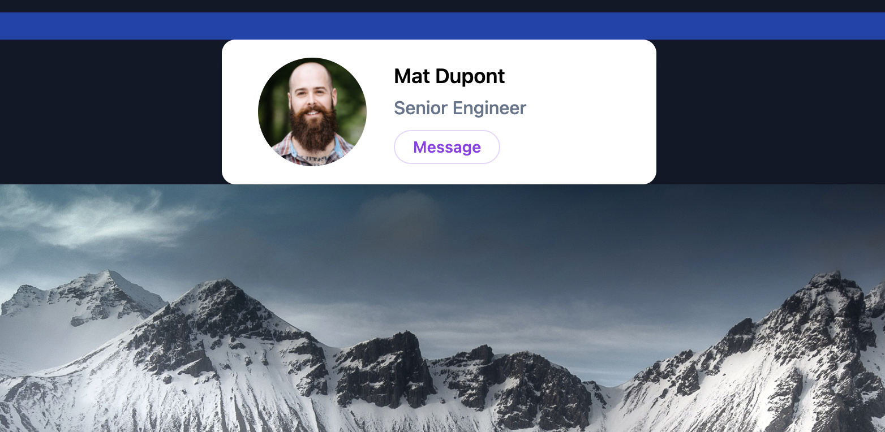
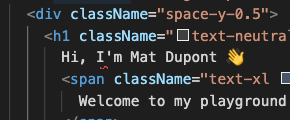
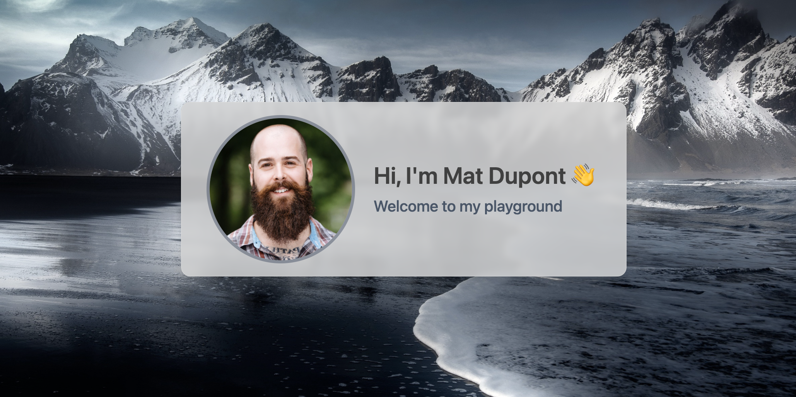
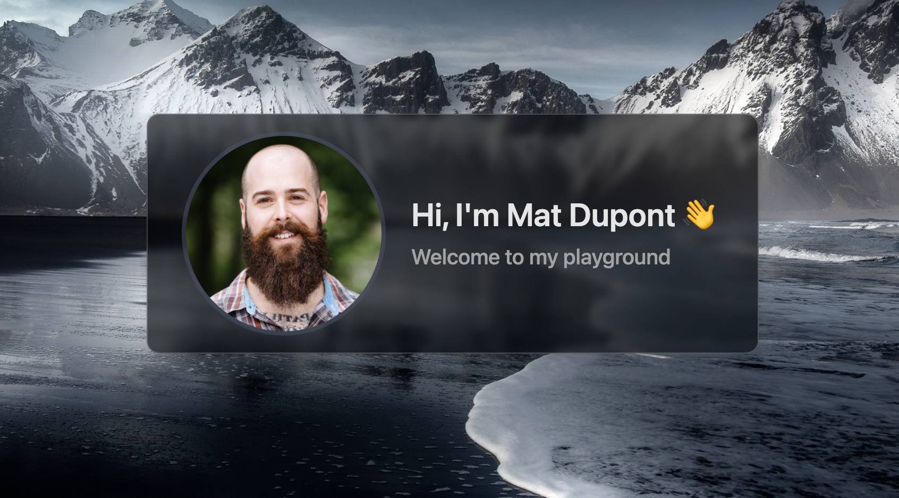

# Homepage + Glassmorphism

Okay, time to get going and make this page something to look at.

## The Background Image

Based on what I'm ready about with this Glassmorphism stuff, it really helps to have a nice background image or a few gradients. I'll go with a kill image.

My go for wallpapers usually ends up being some scenic view from Iceland. Don't get me started on that place. It's the coolest.

Anyway, I found a really good one.

There seems to be a few different ways to set [background images in TWCSS](https://tailwindcss.com/docs/background-image#customizing-your-theme)

I don't really feel like hard coding the path in my homepage component and I want to learn more about **Customizing my theme**, so I'll go that route rather than using the **Arbitrary values** pattern.

I'll extend the _`tailwind.config.js`_ file to include a `backgroundImage` called `homepage-image`:

```js
...
   extend: {
      backgroundImage: {
        'homepage-image': 'url(./assets/iceland-dark.jpeg)',
      },
    },
...
```

What this does is give me access to a new css class called `bg-home-image`. With Intellisense to boot. Sick!

I actually want this on my `<body />` tag, so I'll put that in my _`main.css`_ file.

```css
@tailwind base;
@tailwind components;
@tailwind utilities;

@layer base {
  body {
    @apply bg-[#090400] bg-homepage-image bg-cover bg-no-repeat;
  }
}
```

This sets a background color (#090400) in case my image doesn't load, then sets the `bg-homepage-image` from my theme to cover with no repeat.



## The Layout

This card thing from my initial Tailwind tests isn't horrible. I think I'll use that and tweak it.

Not really sure where I want to put it on the page, so I might as well just throw it right smack in the middle for now.

I can also get rid of those headings (for now) and the background colors.

_`/src/pages/home.tsx`_

```js
export function HomePage() {
  return (
    <div className="min-h-screen max-w-screen-xl mx-auto flex justify-center items-center">
      <div className="px-8 border flex bg-white max-w-xl mx-auto rounded-xl py-4 items-center space-y-0 space-x-6">
        ...
      </div>
    </div>
  );
}
```


## Headings

Next, I want to replace my name along with the rest of that stuff with something a bit more friendly and welcoming.

I also what keep accessibility (a11y) in mind, so I'll use an `<h1 />`. This is the one and only `h1` on this page and serves as the (semantic) main title of my page. I'll dive deeper into a11y as I build. **It's important**

The other thing I'm doing is including a `<span />` tag inside the heading. This lets me style parts of the text differently, while keeping it all together for a screen reader.

```html
<div className=" align-top flex flex-column justify-start space-y-2 text-left">
  <div className="space-y-0.5">
    <h1 className="text-neutral-700 font-semibold ">
      Hi, I'm Mat Dupont 👋
      <span className="text-slate-600 font-medium">Welcome to my playground</span>
    </h1>
  </div>
</div>
```

**Someone's not happy. Tweak time!**



In order to use that single quote (the way I want to), I need to wrap that string in brances and back ticks. The problem is that eslint currently has a rule against "unnecessary" curly brances and suggests `&apos;` instead.

I'm not a fan, so I'm killing that rule.

```js
  'react/jsx-curly-brace-presence': ['off'],
```

```html
<div className=" align-top flex flex-column justify-start space-y-2 text-left">
  <div className="space-y-0.5">
    <h1 className="text-neutral-700 font-semibold ">
      {`Hi, I'm Mat Dupont 👋`}
      <span className="text-slate-600 font-medium">Welcome to my playground</span>
    </h1>
  </div>
</div>
```

**Got it!**


## Sizing

It's looking pretty small and lonely in the middle, there. I think I'll amp up the head shot size as well as the text.

While I'm at it, I want a nice border around that image. Looks a little dry, as-is.

```html
<div className="min-h-screen max-w-screen-xl mx-auto flex justify-center items-center">
  <div
    className="px-8 border flex bg-white max-w-xl mx-auto rounded-xl py-4 items-center space-y-0 space-x-6"
  >
    
    <div className=" align-top flex flex-column justify-start space-y-2 text-left">
      <div className="space-y-0.5">
        <h1 className="text-neutral-700 font-semibold text-3xl">
          {`Hi, I'm Mat Dupont 👋`}
          <span className="text-slate-600 font-medium text-xl">Welcome to my playground</span>
        </h1>
      </div>
    </div>
  </div>
</div>
```

This is looking better. I especially like the way I can adjust the opacity on the border by adding the fraction (or percentage, depending how you want to read it): `border-slate-600/50`


## Glassmorphism

The trick behind Glassmorphism is to use the [backdrop-filter](https://developer.mozilla.org/en-US/docs/Web/CSS/backdrop-filter) along with some opacity, box-shadow and a border (particularly on a dark background).

Now, this first example is my light mode. I'll be doing dark mode second.

```html
<div className="min-h-screen max-w-screen-xl mx-auto flex justify-center items-center">
  <div
    className="px-8 border flex backdrop-blur-sm backdrop-brightness-50 bg-white bg-opacity-70 backdrop-saturate-150 border-neutral-200/25 max-w-xl mx-auto rounded-xl shadow-lg py-4 items-center space-y-0 space-x-6"
  >
    
    <div className=" align-top flex flex-column justify-start space-y-2 text-left">
      <div className="space-y-0.5">
        <h1 className="text-neutral-700  font-semibold text-3xl">
          {`Hi, I'm Mat Dupont 👋`}
          <span className="text-xl text-slate-600  font-medium">{`Welcome to my playground`}</span>
        </h1>
      </div>
    </div>
  </div>
</div>
```

It's pretty subtle, but it's there. Pretty cool!



## Dark Mode Glassmorphism

For this one, I'll get to see if Tailwind really shines by using `dark:` prefix.

My computer is typically set to dark theme and that's what Tailwind looks at to decide which styles should be applied. So far, I just didn't have any dark-specific classes.

First, I'll change the background. Here's are the base (light) classes followed by their respective dark classes:

```css
bg-white dark:bg-black dark:bg-opacity-20
```

Next, I'll adjust the text color to white.

```css
// h1
text-neutral-700 dark:text-neutral-200

// span
text-slate-600 dark:text-neutral-400

```

**Now we're talkin'!**



I think I can still do a bit better. Something that **pops**! A background swap!

Back to the _`tailwind.config.js`_ file, I'll rename my current `backgroundImage` and add my dark theme version.

```js
...
   extend: {
      backgroundImage: {
        'homepage-image-dark': 'url(./assets/iceland-dark.jpeg)',
        'homepage-image-light': 'url(./assets/iceland-light.jpeg)',
      },
    },
...
```

_`main.css`_:

```css
@tailwind base;
@tailwind components;
@tailwind utilities;

@layer base {
  body {
    @apply min-h-screen  bg-[#090400] bg-homepage-image-light dark:bg-homepage-image-dark bg-cover bg-no-repeat;
  }
}
```

Same image, different season!


A few little tweaks to bring out some of the colours from the background:

```cs
// img
border-slate-600/50 dark:border-yellow-600/50

// span
text-slate-600 dark:text-amber-400
```

**I dig it!**


