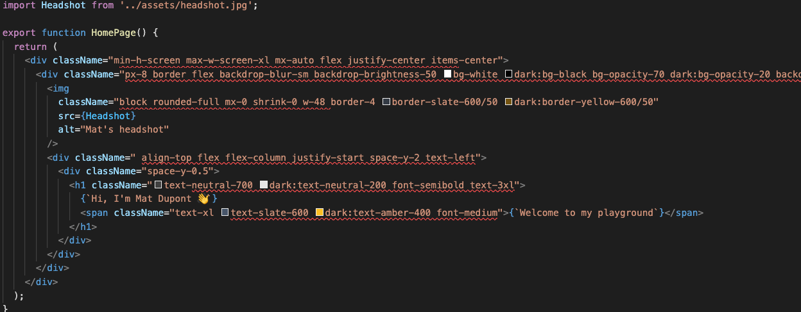
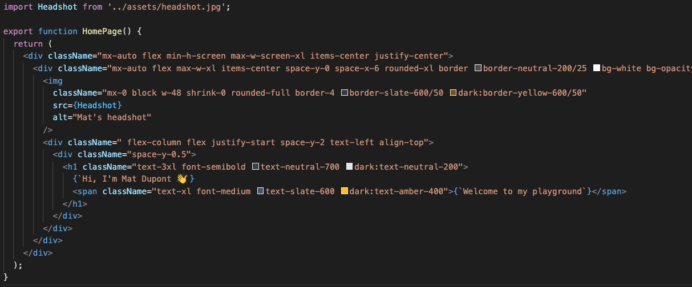

# TailwindCSS + Prettier

After having gone through the initial build of the homepage, I'm finding my className props to be pretty unruly.

Coming from a CSS-in-JS background with recent patterns using the sx property, I like to have my styles listed in an object and easy to read. I'll honest, so far TWCSS isn't really giving me that.

## Prettier Plugin

Thankfully, an official [Prettier Plugin](https://github.com/tailwindlabs/prettier-plugin-tailwindcss) for TailwindCSS was [released last month](https://tailwindcss.com/blog/automatic-class-sorting-with-prettier).

I don't expect it to be the silver bullet to my code styling woes, but this should help.

**Installation and configuration**:

```sh
yarn add -D prettier-plugin-tailwindcss
```

_`.prettierrc.js`_:

```js
module.exports = {
  printWidth: 100,
  singleQuote: true,
  tailwindConfig: './tailwind.config.js',
};
```

Now, I'll check my _`/src/pages/home.tsx`_ file:



Clearly, it's finding some things in doesn't like 😅

**Cmd+S**



... Pretty underwhelming, but it's something!

Again, I wasn't expecting a life changing tool, here.

I'm little surprised it didn't clean up the leading space in that 3rd `<div>` className though.

Either way, my code is that much cleaner, so I'll take it!
