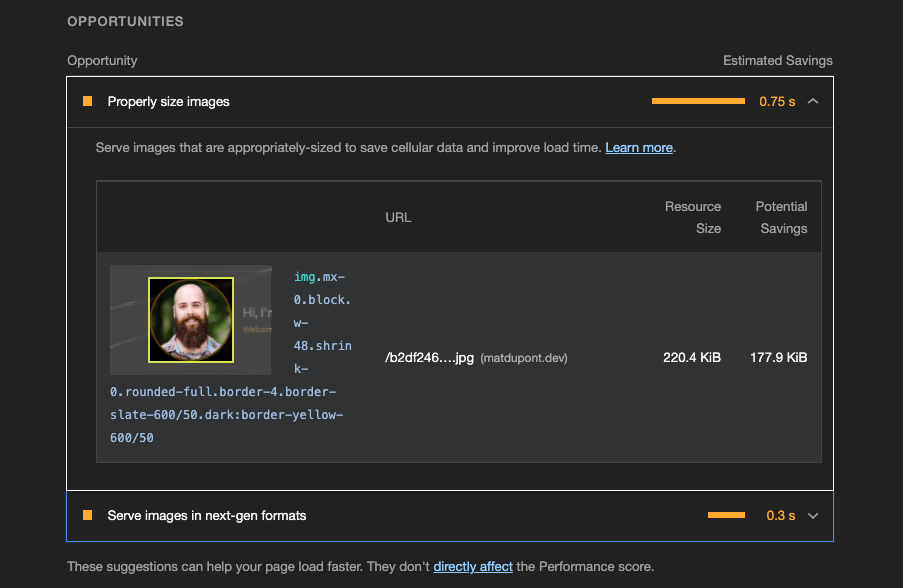

# Lighthouse

Okay, time to look at the overall site metrics. I'm sure there are some pretty glaring issues under the hood.

I swear, I didn't knowingly use any massive, unoptimized images or forget to make the page responsive for the sake of this blog. 😏

## The First Audit

I'll open up DevTools and kick off the first audit. **Generate report!**

😐

I mean... I guess it could be worse? 100 for Best Practices!

Let's dive in.

## Performance

It looks like the big culprits are _**Time to Interactive**_, _**Total Blocking Time**_ and _**Largest Contentful Paint**_.

Here's a breakdown of this gibberish:

#### First Contentful Paint (FCP)

How long it takes to paint (show, render, etc...) the first text or image.

#### Speed Index

A score generated by the [Speedline Node.js module](https://github.com/paulirish/speedline) to measure how fast the content is visually displayed.

#### Largest Contentful Paint (LCP)

The render time for the largest "thing" on the site such as an image or text block.

In this case, it probably has to do with that massive background image.

#### Time to Interactive (TTI)

How long it takes for the page to be completely interactive.

I don't have anything interactive per se, but Lighthouse still gives the score.

JavaScript loading and executing has a big impact here. Since I'm loading React, the page isn't considered "interactive" until everything is completely loaded among other things.

#### Total Blocking Time (TBT)

The sum of any tasks happening between the FCP and the TTI than take longer than 50ms to complete.

#### Cumulative Layout Shift (FCP)

How much things move as they're rendered.

For example, text and content moving around as images are loaded. Stuff like that.

### The Weighting

As of this moment, Lighthouse is on [version 8](https://web.dev/performance-scoring/#lighthouse-8) and has the following weighting to calculate my score of **50**.

**First Contentful Paint** - _10%_
**Speed Index** - _10%_
**Largest Contentful Paint** - _25%_
**Time to Interactive** - _10%_
**Total Blocking Time** - _30%_
**Cumulative Layout Shift** - _15%_

Looks like I'm really shitting the bed with the two most crucial metrics. 😒

## Opportunities

The _Opportunities_ section gives me areas of opportunity within my page with specifics on offending code or items.

For example, the background and headshot images are destroying my performance.

## Diagnostics

_Diagnostics_ include some other specific task that could help me improve on performance.

**\*Note: Something to keep in mind is that these Opportunities and Diagnostics and an indirect imact on my score. The metrics defined above are a general calculation across the page with multiple factors.**
