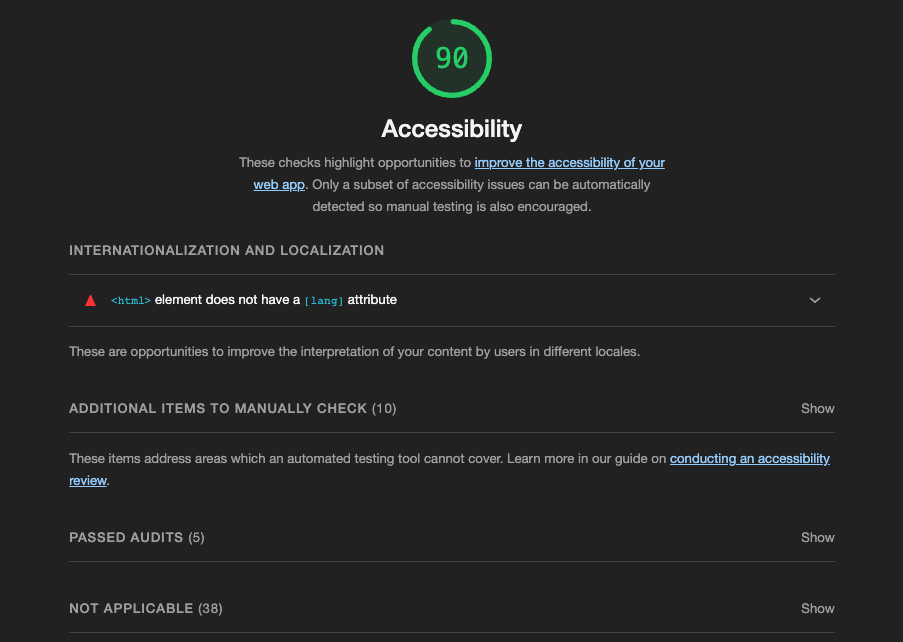
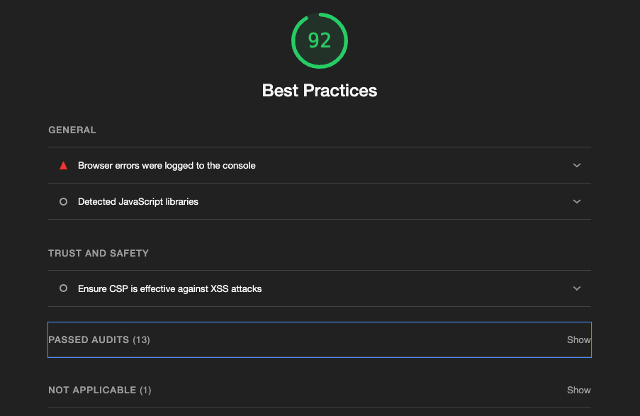
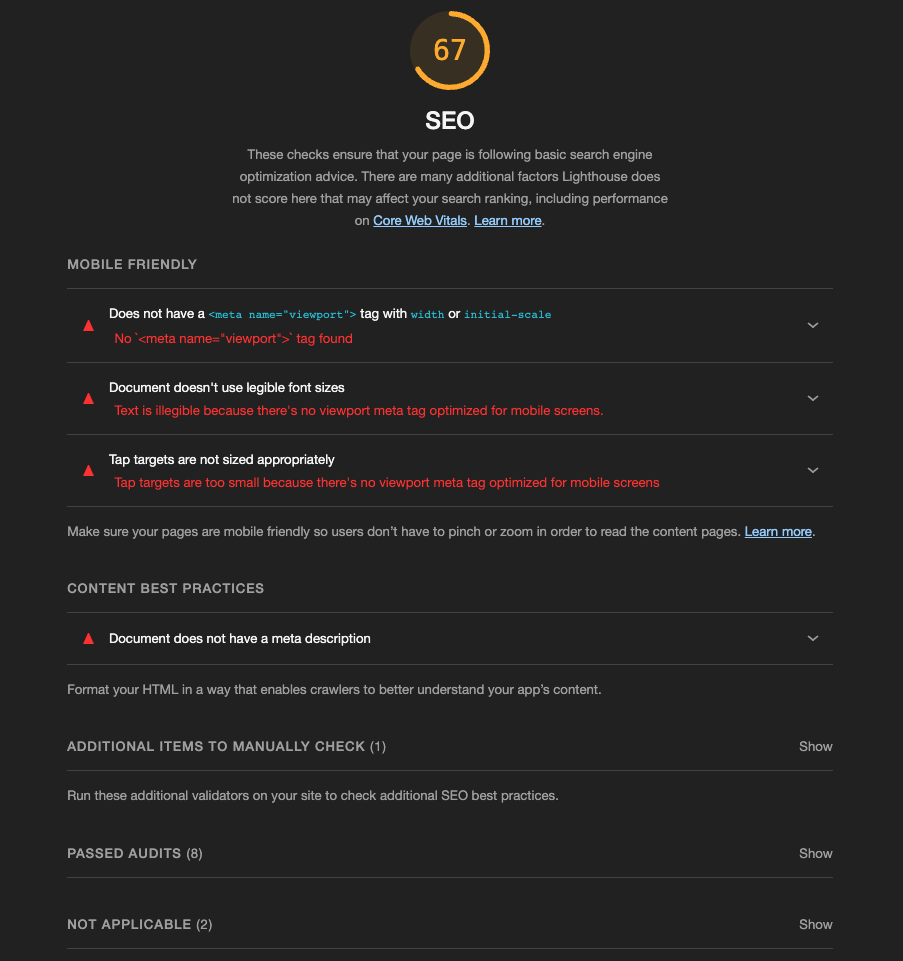
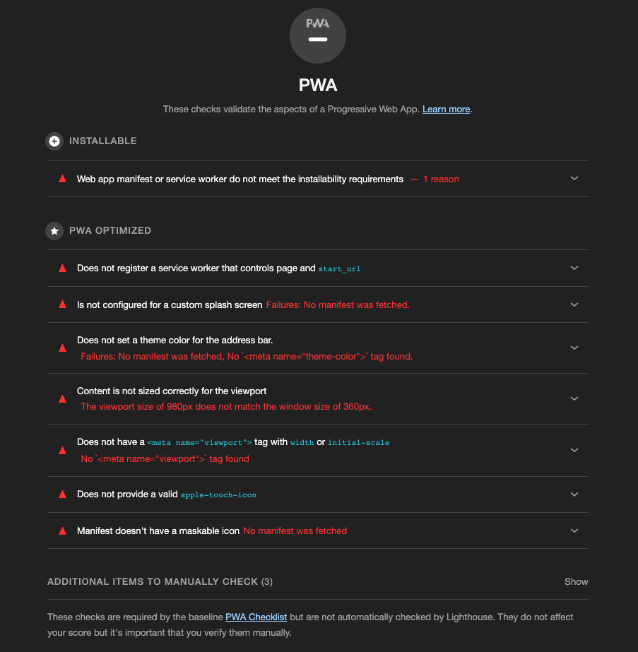

# Lighthouse Continued

## Accessibility

At first glance, this are looking pretty good for my site's accessibility (a11y).

I won't let this fool me into a false sense of confidence. Lighthouse A11y audits checks for the lowest bar in terms of actual user accessibility.

That being said, I'm definitely missing the `lang` attribute on my `<html>` tag. Lowest bar or not, heed these warnings.

Thankfully, we get a list of manual checks. I'm a firm believer that a11y is extremely important and that the internet is for everyone. With that, I would prefer these manual checks were more prominent on this page.

More on manual and automated a11y checks coming soon.

## Best Practices

In terms of best practices, it looks like I just have one recommendation.

It seems I'm missing a `favicon.ico` for my site. The browser is automatically looking for this, so the network call throws 403 error.

Clearly, this is no good.

## SEO

The biggest hit to my Lighthouse score is the SEO score.

From the looks of it, I'm passing 8 audits but my mobile experience is shit. I'm missing some basic `<meta>` tags among other things.

I think this will be an easy fix!

## PWA

I've done literally no work in regards to a PWA (Progressive Web App), so this score is hardly surprising.

Clearly, this is not a PWA right now.

Manifest files and application-specific settings aside, it looks like I'll get to knock out a few of these issues as I tackle some of other audits.

## Let's hit it

[Follow along](https://github.com/matldupont/matdupont-dev/blob/main/blog/220227/02-improvements.md) as I start tackling some of these issues.
