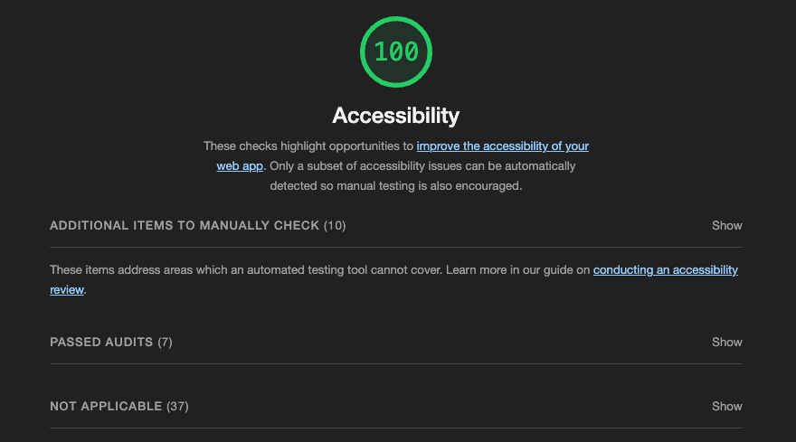
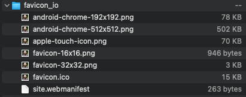

# Audit improvements

## Accessibility

I only seem to have one glaring a11y issue, so I'll knock that one out right away.

```
<html> element does not have a [lang] attribute
```

The problem here is that I'm not telling the browser that my copy is in English. This leaves a screen reader to try going through my site in whatever language is set in a user's screen reader.

I'm not sure if or when I'll tackle an internationalization (i18n) for the site, but for now it's a matter of setting this in my _`/src/index.html`_

```html
<html lang="en" class="h-full bg-red-300 dark:bg-red-900"></html>
```

I can test this change by running another audit from my dev server. I'm not currently concerned with the Performance score, so I don't have to go through the trouble of redeploying with every change just yet.

Sweet.



I'll reiterate that this doesn't necessarily mean my site is completely accessible to all users. I just don't have any super obvious issues.

## Best Practices

Next up, what's the favicon crap?!

Welp, I don't have a logo nor the skills to design and create one in a pinch. Might as well use my headshot! It'll be tiny, but it'll be something. Besides, it'll be on only page anyway. People will be able to put 2 and 2 together, right? 🤞

So, the massive _`headshot.jpg`_ is my source. I'll head over to [favicon.io](https://favicon.io/favicon-converter/) to generate my favicon.

As expected, I can't just convert this source file. I have to convert to an intermediate png first.

[cloudconvert](https://cloudconvert.com/jpg-to-png) has my back!

So, I first create a _`headshot.png`_ from my _`headshot.jpg`_ file. Might as well add that to my `/src/assets` folder for safe keeping.

Next, I create the _`favicon.ico`_ from _`headshot.png`_

This great! favicon.io didn't just create the one file, but all the variants I'll likely need. This should come in handy when I get to my PWA. 🤘



I'm going to dump all the contents into a new `/src/assets/favicon/` directory.

Since I'm using Webpack to bundle all my code create the index.html for the site, this is where I can set the favicon. All I have to do is add to the `HtmlWebpackPlugin` configuration.

_`webpack.common.config.js`_:

```js
...
plugins: [
  new HtmlWebpackPlugin({
    template: 'src/index.html',
    favicon: 'src/assets/favicon/favicon.ico',
  }),
  ...
]
...
```
