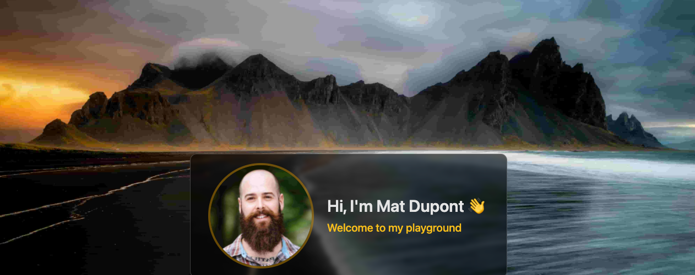
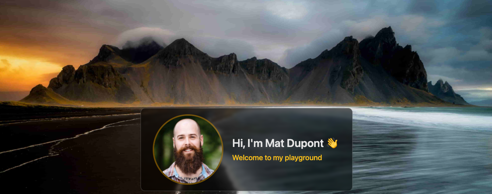
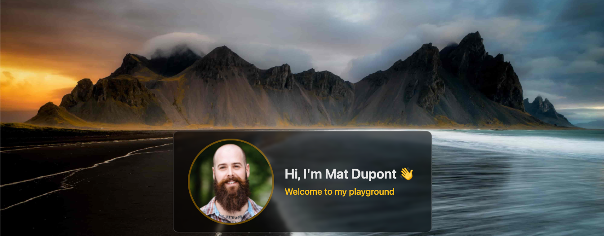
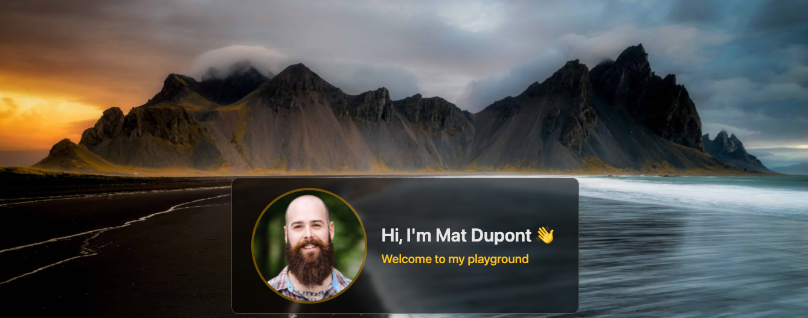
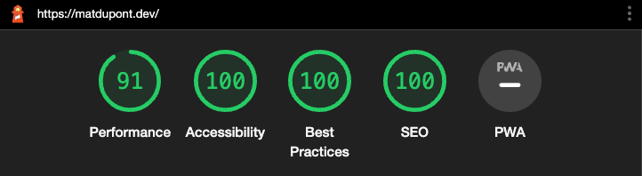

# Lighthouse Audit Improvements

At the end of the [previous post](https://github.com/matldupont/matdupont-dev/blob/main/blog/220227/02-improvements.md), things were really starting to shape up:


## Performance

Time to tackle this Performance metric.


From the looks of it, most of my issues are related to the images. I'm also getting some notes regarding my caching policy and JavaScript.

### Image Optimization

I'll go after the quickest win first. My headshot image is missing explicit `width` and `height` attributes.

This is causing layout shift and affecting the Content Layout Shift (CLS) score.

I had already set the width of the `` in _`/src/pages/home.tsx`_ using Tailwind's `w-48` class, so I'll add the matching `h-48` as well as the inline `width` and `height` props.

```jsx
...
 
...
```

Now, I'll look at some options for image compression.

With the [ImageMinimizerWebpackPlugin](https://webpack.js.org/plugins/image-minimizer-webpack-plugin/), is seems I have a few different options:

> - [imagemin](https://github.com/imagemin/imagemin) - optimize your images by default, since it is stable and works with all types of images
> - [squoosh](https://github.com/GoogleChromeLabs/squoosh/tree/dev/libsquoosh) - while working in experimental mode with .jpg, .jpeg, .png, .webp, .avif file types.

I may try both, but I'll start with **imagemin**.

```sh
yarn add -D image-minimizer-webpack-plugin imagemin
```

In addition, I can go with [lossless](https://en.wikipedia.org/wiki/Lossless_compression) or [lossy](https://en.wikipedia.org/wiki/Lossy_compression) mode. I want to see what I can sqeeze out with the highest quality first, so I'll go **lossless**.

#### Lossless

```sh
yarn add -D imagemin-gifsicle imagemin-jpegtran imagemin-optipng imagemin-svgo
```

Time to hit up the ol' _`webpack.common.config.js`_:

First, I'll adjust asset rule test as I'm currently missing support for svg:

```js
...
rules: [
  {
    test: /\.(jpe?g|png|gif|svg)$/i,
    type: 'asset/resource',
  },
],
...
```

Based on the documentation for ImageMinimizerWebpackPlugin, I need to add the `optimization` configuration leaded with the imported plugin:

```js
const ImageMinimizerPlugin = require("image-minimizer-webpack-plugin");
const { extendDefaultPlugins } = require("svgo");
...

module.exports = {
  ...
  optimization: {
    minimizer: [
      new ImageMinimizerPlugin({
        minimizer: {
          implementation: ImageMinimizerPlugin.imageminMinify,
          options: {
            // Lossless optimization with custom option
            // Feel free to experiment with options for better result for you
            plugins: [
              ['gifsicle', { interlaced: true }],
              ['jpegtran', { progressive: true }],
              ['optipng', { optimizationLevel: 5 }],
              // Svgo configuration here https://github.com/svg/svgo#configuration
              [
                'svgo',
                {
                  plugins: extendDefaultPlugins([
                    {
                      name: 'removeViewBox',
                      active: false,
                    },
                    {
                      name: 'addAttributesToSVGElement',
                      params: {
                        attributes: [{ xmlns: 'http://www.w3.org/2000/svg' }],
                      },
                    },
                  ]),
                },
              ],
            ],
          },
        },
      }),
    ],
  },
}
```

I'll save and try building to see what happens.

😕

It would seem some of the docs are a bit outdated. It happens.

```sh
"extendDefaultPlugins" utility is deprecated.
Use "preset-default" plugin with overrides instead.
For example:
{
  name: 'preset-default',
  params: {
    overrides: {
      // customize plugin options
      convertShapeToPath: {
        convertArcs: true
      },
      // disable plugins
      convertPathData: false
    }
  }
}
```

I'll remove the import

```js
const { extendDefaultPlugins } = require('svgo');
```

and replace the `extendDefaultPlugins` function with `'preset-default'`

```js
plugins: [
  ['gifsicle', { interlaced: true }],
  ['jpegtran', { progressive: true }],
  ['optipng', { optimizationLevel: 5 }],
  // Svgo configuration here https://github.com/svg/svgo#configuration
  ['svgo', 'preset-default'],
],
```

This got rid of the deprecation warning and the build succeeds, but I'm seeing some odd warnings:

```sh
WARNING in "imageminMinify" function do not support generate to "jpg" from "c9b85207d947a1fdec0d.jpeg".
Please use "imageminGenerate" function.
```

I'll follow the recommendation and replace

```js
implementation: ImageMinimizerPlugin.imageminMinify,
```

with

```js
implementation: ImageMinimizerPlugin.imageminGenerate,
```

Build. Those new warnings are gone, but I'm still left with asset size limit warnings for the images.

Since I went with the lossless option first, I couldn't really expect much in terms of compression. The image files are only slightly smaller.

```sh
WARNING in asset size limit: The following asset(s) exceed the recommended size limit (244 KiB).
This can impact web performance.
Assets:
  2c0bc7893f43e1b02e9c.jpg (2.72 MiB)
  d6d74463cd124f5d5853.jpg (2.18 MiB)
```

Time to try lossy!

#### Lossy

```sh
yarn add -D imagemin-gifsicle imagemin-mozjpeg imagemin-pngquant imagemin-svgo
```

Adjust the plugins:

```js
 plugins: [
  ['gifsicle', { interlaced: true }],
  ['mozjpeg', { progressive: true }],
  ['pngquant', { optimizationLevel: 5 }],
  ['svgo', 'preset-default'],
],
```

> Something to note is that I'm only using a few jpegs at this point, but including the plugins for gif, png and svg.

Let's see what's up...

```sh
WARNING in asset size limit: The following asset(s) exceed the recommended size limit (244 KiB).
This can impact web performance.
Assets:
  a4bcfbd351e259bc7c46.jpg (813 KiB)
  7708073eeaeddfe36919.jpg (639 KiB)
```

Still a warning, but quite the improvement!

Quick visual check in the browser and I can't really tell the difference. That's a good sign.

I not only want to get rid of that warning, but I want to see how far I can squeeze things.

I'll take the ol' guitar tuning approach: Make it real bad, then turn till it sounds right.

I can set the quality value from 0 to 100 on the `mozjpeg` plugin. Let's start at 10.

```js
['mozjpeg', { progressive: true, quality: 10 }],
```

##### Quality: 10

File sizes: ~75-85kB



##### Quality: 20

File sizes: ~150kB



##### Quality: 30

File sizes: ~215-225kB



This is actually pretty decent and still below the asset limit of 250kB.

##### Quality: 40

File sizes: ~270-300kB



This looks good, but I'm past that limit. Now, this is just the Webpack limit. I have run the audit to see what kind of performance score I get with this.

I'll leave it at 40 and see how that goes.



I mean... it's pretty good.
