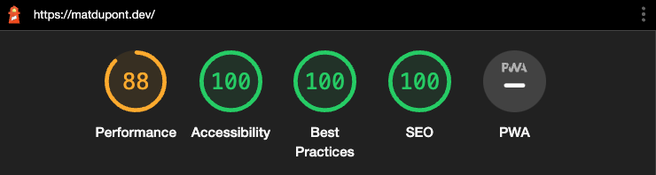
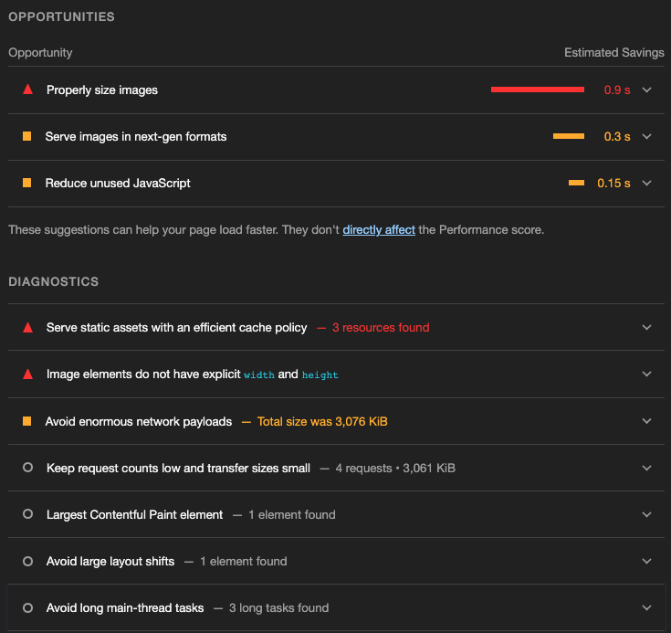

# Lighthouse Audit Improvements

At the end of the [previous post](https://github.com/matldupont/matdupont-dev/blob/main/blog/220227/02-improvements.md), things were really starting to shape up:

## Performance

Time to tackle this Performance metric.

From the looks of it, most of my issues are related to the images. I'm also getting some notes regarding my caching policy and JavaScript.

### Image Optimization

I'll go after the quickest win first. My headshot image is missing explicit `width` and `height` attributes.

This is causing layout shift and affecting the Content Layout Shift (CLS) score.
