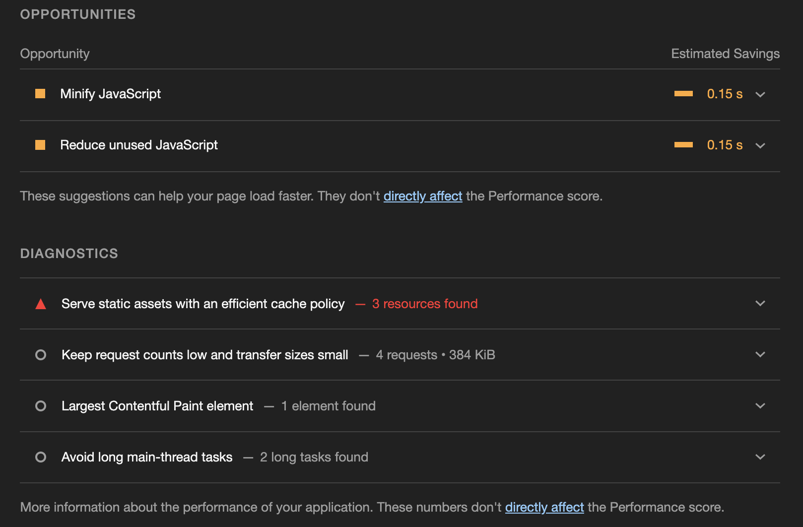
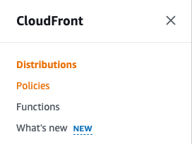
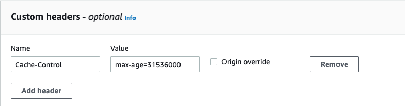
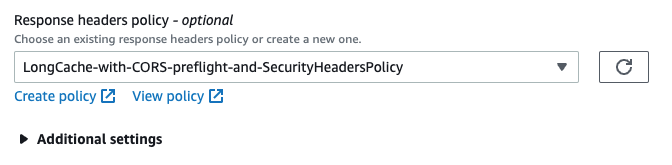
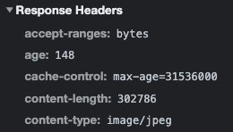
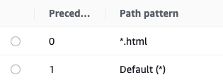
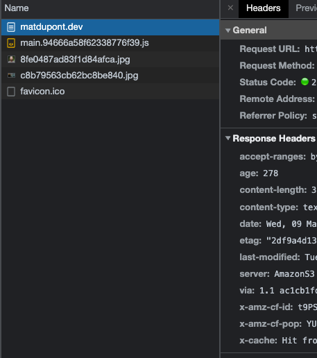
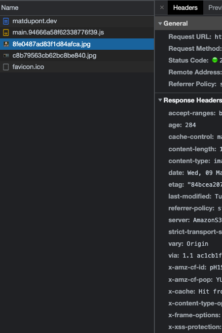

# Cache policy and minification

Before continuing with the Opportunities in reducing my JavaScript, I'd like to addressing the issue with my caching policy (or lack thereof).

This isn't something I'll be addressing in code (yet), so I'll be jumping back into [AWS Console](https://console.aws.amazon.com/).

What's happening is that I'm missing cache-control policy response headers for my site's assets. If I inspect one of the assets (eg: the headshot image file), I see the `x-cache` response header notifying me there was a 'Hit from cloudfront'.

If I go to the CloudFront console and check out the _Behavior_ defined for my site's _Distribution_, I see that my _Cache policy_ is set to the recommended **CachingOptimized** policy. This is great for managing how the CloudFront cache behaves in relation to the storage in S3, but has nothing to do with how the browser will deal with assets.

## Response Header Policies

The CloudFront console menu on the left (it's not super obvious) has a link to **_Policies_**.

Inside, I see a navigation tabs for Cache, Origin request and Response headers. The latter is the one I want.

Here, I see a list of Managed policies provided by AWS as well as a section where I can create Custom policies.

What I'm really after at this point is to create a policy that adds a **Cache-Control** header with a value of **max-age=31536000**. What this does is tell the browser that my assets are good for a year, in seconds. That ought to be enough to address my lack of a "long cache lifetime".

Looking at the list of Managed policies, I would like to use _Managed-CORS-with-preflight-and-SecurityHeadersPolicy_, but since it's missing _Cache-Control_, I'll have to create a custom policy. I could leave out CORS and Security headers for now, but it seems like this **always** comes back to bite me.

My new custom policy will be named _LongCache-with-CORS-preflight-and-SecurityHeadersPolicy_. It's wordy, but clear enough.

As I go through its configuration, I'm simply matching it to _Managed-CORS-with-preflight-and-SecurityHeadersPolicy_. Once that's done, I add my Custom header:

> Cache-Control: max-age=31536000

**Save**.

## Adding to a CloudFront Distribution Behavior

Now that I have my custom policy, I want to make use of it on my site's distribution behavior. I'll navigate to the only behavior I've defined for my distribution, select it and hit **Edit**.

Near the bottom of the behavior's settings, I find what I'm looking for. From the policy list under _Response headers policy - optional_, I'll select the one I created.

I'm not sure if this is necessary, but I'll manually create an Invalidation then go back to my browser.

## Testing and Audit results

After refreshing my browser and checking my network tab, I see all the headers I had configured and most importantly, the cache-control is in effect.

After an audit, I also see the warning is gone. Great!

Uhh... not so fast.

## Tailored Behaviors

My Distribution only contains one behavior for all files and tells my browser to use its cache for a year. What happens when I push new code!?

I don't actually want this behavior for all files.

Thanks to the [contenthash](https://github.com/matldupont/matdupont-dev/blob/main/blog/220130/01-setup-continued.md#building) used in my asset filenames (.js, .jpg, etc...), every deployment creates unique files that aren't in my cache. For that reason, I want those files to be cached as long as possible. When I deploy, those files aren't overwritten but completely replaced.

The cache-control audit warning actually made note of my images and js files, omitting the html file. I **don't** want a long cache for my html. That's where the references to newly built and deployed js files get referenced.

I'll break down what I want to occur:

1. I deploy version 1 of my site.
2. A user accesses the site and receives all the files (html, js, images, etc...)
3. All subsequent visits to my site should download the latest html file from the cdn.
4. The html file references all my assets which are already cached. Site loads right away.
5. I deploy version 2 of the site
6. User visits again, downloading the new html file.
7. The asset references in this latest file aren't cached so it fetches the new versions of those as well.

I absolutely want to get the latest version of the html file at all times. Thankfully, CloudFront is caching the current version of that file using its _CachingOptimized_ policy, so it's sitting there at the edge waiting for me.

### html-specific behavior

All I have to do to solve this is create a second behavior for html files. This one uses the default values aside from the **Redirect HTTP to HTTPS** _Viewer protocol policy_. No Response headers policy.

Another Invalidation for good measure and I can check the browser.

Here, I see that difference in response headers between my main html file and the other assets:

#### HTML

#### JS

#### Sweet!
