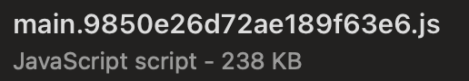
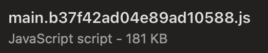
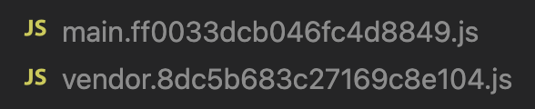

# Code Minification, Splitting and Compression

Now that I have my caching in order as well as image optimization, it's time to get back to the code. The remaining recommendations I'm getting from Lighthouse are in regards to the size of my bundles.

Considering I only have one page with no extra bundle dependencies aside from `react`, `react-dom` and `react-helmet-async`, there's no way I should be blowing whatever budget I'm afforded under the Lighthouse limits.

But who knows?! Let's see what can be done here.

## ESBuildMinifyPlugin

There are a few different options for code minification like Terser, Babel, Uglify, etc... but since I'm already using `esbuild-loader`, I'd like to see if there's anything in that toolbox I can reach for.

Looking back at the [documentation](https://github.com/privatenumber/esbuild-loader#js-minification-eg-terser), it looks like I'm in luck.

**Bonus**, I don't even need to install a separate plugin. `ESBuildMinifyPlugin` is included in the `esbuild-loader` package.

```js
const { ESBuildMinifyPlugin } = require('esbuild-loader')
...

optimization: {
  minimizer: [
    ...
    new ESBuildMinifyPlugin(),
  ],
}
...
```

I currently have just the one bundle file, which is something I'll address next, but I'll check its size to see the effect of minification.

**Before minification**



**After minification**



Down ~24%! I like that.

After another audit, my score hasn't really changed but the Opportunity warnings are gone.

There's more I can do for the score here.

## Code splitting and chunking

As I mentioned earlier, I only have one page at this point. As it stands, I only have a single bundle as well. It includes all my code, but also all the necessary React and TailwindCSS. There's a balance to be struck between multiple small fetches and a single larger fetch.

That being said, I'll definitely be adding more components and pages. I won't want my entire site to exist in a single, massive bundle as the site grows, so I'll be leveraging as much code-splitting as possible.

I'm not in a position to start playing with lazy-loaded components, so I'll stick to ways I can improve my current builds.

#### Node Modules

The biggest thing I can do at this point is separate my vendor code (node*modules) from my application code but using split chunks in *`webpack.common.config.js`\_

```js
...
  optimization: {
    splitChunks: {
      cacheGroups: {
        vendors: {
          test: /[\\/]node_modules[\\/]/,
          name: "vendor",
          chunks: "all"
        }
      }
    }
  },
...
```

I now have two bundles. One for my application code (`main.[contentHash].js`) and dependencies (`vendor.[contentHash].js`). The file sizes are now 27KB and 153KB, respectively.



Now... I've done an another audit and I'm sitting pretty at a score of 99 for Performance.


One thing I'm noticing is the "Reduce unused JavaScript" opportunity is back. This time, it's referring to the vendor file rather than the main file.

After some more research, I see a recommendation to split the chunks further. In this case, I'll try splitting the node_modules as well.

```js
...
optimization: {
  ...
  runtimeChunk: 'single',
  splitChunks: {
    chunks: 'all',
    maxInitialRequests: Infinity,
    minSize: 0,
    cacheGroups: {
      vendor: {
        test: /[\\/]node_modules[\\/]/,
        name(module) {
          // get the name. E.g. node_modules/packageName/not/this/part.js
          // or node_modules/packageName
          const packageName = module.context.match(/[\\/]node_modules[\\/](.*?)([\\/]|$)/)[1];

          // npm package names are URL-safe, but some servers don't like @ symbols
          return `npm.${packageName.replace('@', '')}`;
        },
      },
    },
  },
},
```

Back to a score of 99 and no more unused JS warning!

There's still one more thing I want to try before moving on the addressing the PWA metrics.

## Compression

The two big players in compression seem to be [gzip from GNU](https://www.gnu.org/software/gzip/) and [brotli from Google](https://github.com/google/brotli).

The former is about 3 decades old while the latter is about 9 years old. With gzip being the tried and true method of compression, I'll give that a try first.

In either case, I'll need to install the correct Webpack plugin.

```sh
yarn add -D compression-webpack-plugin
```

### gzip

For the reasons stated above, `gzip` is the default `algorithm` for the **CompressionWebpackPlugin**. Not a whole lot to do here.

_`webpack.common.config.js`_:

```js
const CompressionPlugin = require("compression-webpack-plugin");

...
plugins: [
  ...
  new CompressionPlugin()
],
...
```

I now see all the compressed files alongside the originals. Now to deploy and run the audit.

## The verdict

As it turns out, this consistently gave me a score around 94 rather than the 99 I already had and affected the Largest Contentful Paint time.

To be honest, I'm not 100% sure why that's happening, but I will say that since I have the **CachingOptimized** policy on my CloudFront distribution, I was already benefitting from compression.


Maybe it it's competing at this point? 🤷

I'll remove the CompressionPlugin call it a day.
