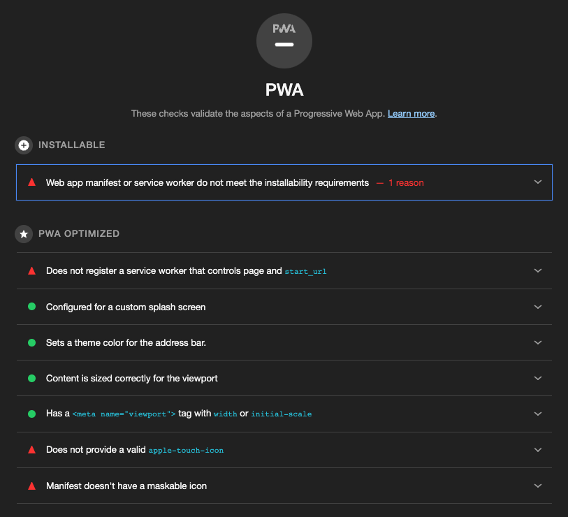
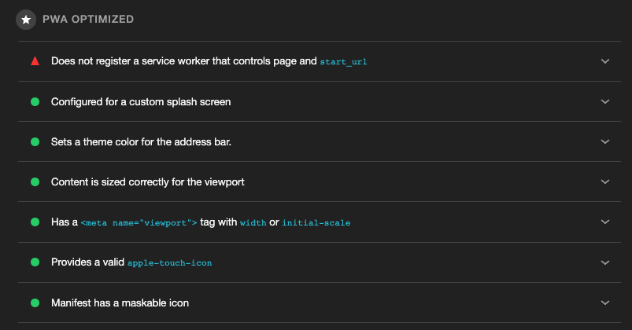
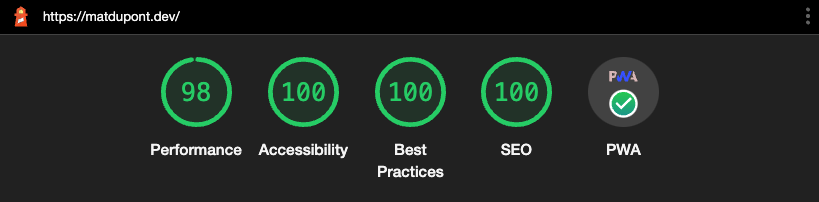
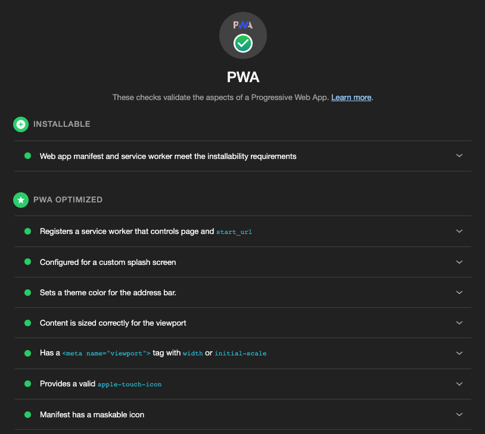

# Progressive Web Applications

By the end of the [last post](https://github.com/matldupont/matdupont-dev/blob/main/blog/220312/01-minification-splitting-compression.md), this were looking pretty good!


The last item on the list isn't a score out of 100, but a set of criteria to meet in order to qualify this site as a **Progressive Web App (PWA)**.

## Helper script

Now that I'm less concerned about performance, I want the ability to test audits without waiting for a full deploy each time.

I'll install the `http-server` package so I can run a server locally and run my audits.

```sh
yarn add -D http-server
```

Then, I'll add a script to kick it off whenever I need it.

_`package.json`_:

```json
"scripts": {
  ...
  "start": "http-server build"
}
```

This is what I'll be using for the rest of this post to test my changes\*.

## Installable

First, the site/app must be "installable". Once an web app is installable, anyone visiting the site may **Add to Hone Screen** from Safari's share menu. Check [this](https://support.google.com/chrome/answer/9658361) out to read more about installing on other devices.

In order for this to be possible, my application needs two crucial bits of technology.

### Manifest file

A manifest (or Web app manifest) file lets me define information necessary for the app installation like its name, icons, start_url, etc...

Since I want to both create this file, give its filename a contenthash like all the others and have it injected into my build html file, I'll be using the `webpack-pwa-manifest` plugin.

```sh
yarn add -D webpack-pwa-manifest
```

_`webpack.common.config.js`_:

```js
...
const WebpackPwaManifest = require('webpack-pwa-manifest');
...

plugins: [
  ...
  new WebpackPwaManifest({
    name: 'MatDupont.dev',
    short_name: 'MatDupont.dev',
    description: "Mat Dupont's personal site and playground",
    orientation: 'portrait',
    display: 'standalone',
    start_url: '.',
    background_color: '#1e150e',
    theme_color: '#1e150e',
    inject: true,
    crossorigin: 'use-credentials', //can be nul l use-credentials or anonymous
    icons: [
      {
        src: path.resolve('src/assets/headshot-600w.jpeg'),
        sizes: [96, 128, 192, 256, 384, 512], // multiple sizes
        ios: true,
      },
      {
        src: path.resolve('src/assets/headshot.png'),
        size: '1024x1024', // you can also use the specifications pattern
      },
    ],
  }),
]
...
```

Here, I'm setting all the relevant information for my application, colors as well as the images to use for the various icon sizes.

After another audit, I see that some items are getting checked off the list:



For now, I'll disregard the first "PWA Optimized" item and will address the last two in the list referring to icons.

An `apple-touch-icon` is the setting used as the installed application's icon on iOS devices.

I can fix this by adding just a few settings to the `WebpackPwaManifest` plugin. It's actually just the same setting into two places.

I'll add `ios: true` to the main plugin config as well as the first icon definition:

```js
...
plugins: [
  ...
  new WebpackPwaManifest({
    name: 'MatDupont.dev',
    short_name: 'MatDupont.dev',
    description: "Mat Dupont's personal site and playground",
    orientation: 'portrait',
    display: 'standalone',
    start_url: '.',
    background_color: '#1e150e',
    theme_color: '#1e150e',
    inject: true,
    ios: true, //<===== here
    crossorigin: 'use-credentials',
    icons: [
      {
        src: path.resolve('src/assets/headshot-600w.jpeg'),
        sizes: [96, 128, 192, 256, 384, 512],
        ios: true, //<===== here
      },
      {
        src: path.resolve('src/assets/headshot.png'),
        size: '1024x1024',
      },
    ],
  }),
]
...
```

**Maskable icons** were introduced in order for images to fill the entire circular PWA icons on Android devices. Without this, the image provided would be centered with the surrounding area with the circle being white.

I'll add another config for the main headshot here with the additional settings.

```js
...
plugins: [
  ...
  new WebpackPwaManifest({
    name: 'MatDupont.dev',
    short_name: 'MatDupont.dev',
    description: "Mat Dupont's personal site and playground",
    orientation: 'portrait',
    display: 'standalone',
    start_url: '.',
    background_color: '#1e150e',
    theme_color: '#1e150e',
    inject: true,
    ios: true,
    crossorigin: 'use-credentials',
    icons: [
      {
        src: path.resolve('src/assets/headshot-600w.jpeg'),
        sizes: [96, 128, 192, 256, 384, 512],
        ios: true,
      },
      {
        src: path.resolve('src/assets/headshot.png'),
        size: '1024x1024',
      },
      {
          src: path.resolve('src/assets/headshot.png'),
          size: '1024x1024',
          purpose: 'maskable',
        },
    ],
  }),
]
...
```

Getting there:



### Service Worker

Service workers are a really nifty technology used to control how applications can leverage caching to work offline among other things. Check out the (mdn web docs)[https://developer.mozilla.org/en-US/docs/Web/API/Service_Worker_API] on the topic for a deep dive.

> TLDR; It's like a proxy server that sites between web applications, the browser, and the network (when available).

This is really the main tech behind PWAs that unlocks a ton of functionality and fine grained control of the app experience. We can control things like where content is fetched first (network or cache), how and when things get added to the catch, etc...

The biggest thing to know and remember is that because of the inherent risks when exposing these capabilities, service workers can **only work over HTTPS**.

\*This also means I have to do full deploys to test from my secure domain.

[Workbox](https://developers.google.com/web/tools/workbox) from Google really handles a ton of the overhead with this part. This way, I can use the baked in defaults and only dive in if I fine I need to deviate.

Again, I'll go for a Webpack plugin to help me out.

```sh
yarn add -D workbox-webpack-plugin
```

_`webpack.common.config.js`_:

```js
...
const WebpackPwaManifest = require('webpack-pwa-manifest');
...

plugins: [
  ...
  new WorkboxPlugin.GenerateSW({
    // these options encourage the ServiceWorkers to get in there fast
    // and not allow any straggling "old" SWs to hang around
    clientsClaim: true,
    skipWaiting: true,
  }),
]
...
```

#### Service Worker Registration

At this point, I have Webpack and Workbox creating my _`service-worker.js`_ file and injecting into my main html file.

I have to register the service worker myself for the application to make use of it.

```js
if ('serviceWorker' in navigator) {
  window.addEventListener('load', () => {
    navigator.serviceWorker
      .register('/service-worker.js')
      .then((registration) => {
        console.log('SW registered: ', registration);
      })
      .catch((registrationError) => {
        console.log('SW registration failed: ', registrationError);
      });
  });
}
```

As you can see, this is just vanilla JS using the global `window` object.

> `navigator` lives in the window object. I don't need to reference it as `window.navigator`.

This snipped simple checks if the browser supports `serviceWorker` and adds a 'load' even listener on the window. Once loaded, the serviceWorker API registers the worker created and written to `service-worker.js`. There are success and error console logs just to notify me if things are running as they should.

I would throw this right in my main _`index.tsx`_ file but I'd rather put it in a util function.

Time for a new file: _`/src/utils/serviceWorker.ts`_:

```js
export const registerServiceWorker = () => {
  if ('serviceWorker' in navigator) {
    window.addEventListener('load', () => {
      navigator.serviceWorker
        .register('/service-worker.js')
        .then((registration) => {
          console.log('SW registered: ', registration);
        })
        .catch((registrationError) => {
          console.log('SW registration failed: ', registrationError);
        });
    });
  }
};
```

_`src/index.tsx`_:

```js
...
import { registerServiceWorker } from './utils/serviceWorker';

...

registerServiceWorker();
```

## Installable and Optimized

Now that I've addressed these items, my app is installable and has everything necessary to run as a PWA.




