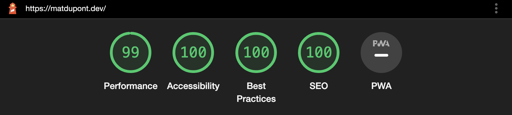
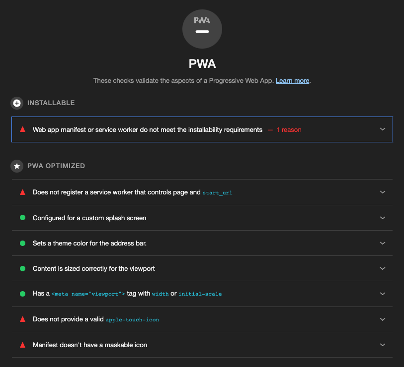

# Progressive Web Applications

By the end of the [last post](https://github.com/matldupont/matdupont-dev/blob/main/blog/220312/01-minification-splitting-compression.md), this were looking pretty good!



The last item on the list isn't a score out of 100, but a criteria to meet in order to qualify this site as a **Progressive Web App (PWA)**.

## Installable

First, the site/app must be "installable". Once an web app is installable, anyone visiting the site may **Add to Hone Screen** from Safari's share menu. Check [this](https://support.google.com/chrome/answer/9658361) out to read more about installing on other devices.

In order for this to be possible, my application needs two crucial bits of technology.

### Manifest file

A manifest (or Web app manifest) file lets me define information necessary for the app installation like its name, icons, start_url, etc...

Since I want to both create this file, give its filename a contenthash like all the others and have it injected into my build html file, I'll be using the `webpack-pwa-manifest` plugin.

```sh
yarn add -D webpack-pwa-manifest
```

_`webpack.common.config.js`_:

```js
...
const WebpackPwaManifest = require('webpack-pwa-manifest');
...

plugins: [
  ...
  new WebpackPwaManifest({
      name: 'MatDupont.dev',
      short_name: 'MatDupont.dev',
      description: "Mat Dupont's personal site and playground",
      orientation: 'portrait',
      display: 'standalone',
      start_url: '.',
      background_color: '#1e150e',
      theme_color: '#1e150e',
      inject: true,
      crossorigin: 'use-credentials', //can be nul l use-credentials or anonymous
      icons: [
        {
          src: path.resolve('src/assets/headshot-600w.jpeg'),
          sizes: [96, 128, 192, 256, 384, 512], // multiple sizes
          ios: true,
        },
        {
          src: path.resolve('src/assets/headshot.png'),
          size: '1024x1024', // you can also use the specifications pattern
        },
      ],
    }),
]
```

Here, I'm setting all the relevant information for my application, colors as well as the images to use for the various icon sizes.

After another audit, I see that some items are getting checked off the list:


